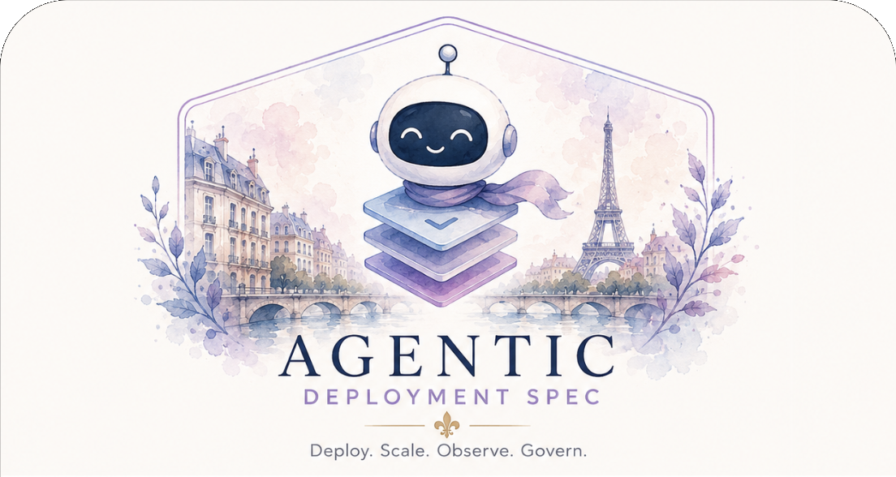

# Agentic Deployment Specification

<p align="center">
  
</p>

> A vendor-neutral deployment contract for self-hosted applications and agentic systems.

The Agentic Deployment Specification (ADS) lets an application describe how it should be deployed, secured, observed, and governed. Instead of forcing deployment agents or platform teams to reverse-engineer a repository, ADS makes operational intent explicit and machine-readable.

## Status

ADS is in v1.0 release-candidate stabilization. The stable ADS v1 API version is `ads.dev/v1`; the reference examples and JSON Schema target that version. v0.3 made the model machine-validatable with JSON Schema, fixtures, and processor conformance rules. v0.4 added profile-oriented examples. v0.5 hardened security, supply-chain, policy, and operational readiness requirements.

## What ADS is

ADS is a specification for describing deployment requirements that downstream tools can satisfy with Kubernetes, Docker Compose, managed container runtimes, GitOps systems, policy engines, or other infrastructure.

ADS is designed for:

- platform engineers operating self-hosted software
- AI deployment agents that need a safe contract to follow
- self-hosting vendors and open-source maintainers
- enterprise security and governance teams
- customers deploying software into their own environments

## What ADS is not

ADS is not a replacement for Kubernetes manifests, Helm charts, CI/CD pipelines, secrets managers, model-serving protocols, or agent frameworks. It describes the operational requirements those systems must satisfy.

## Core Principles

- Vendor neutral: ADS describes intent, not a single platform implementation.
- Human approval by default: risky deployment and tool actions must be explicit.
- Self-hosting first: customer-controlled environments are a primary target.
- AI-native: agents, tools, memory, policy, and observability are first-class concerns.
- Open standard: the specification should be readable by humans and enforceable by machines.

## Documentation Map

For ADS authors:

- [SPEC.md](SPEC.md) is the normative release-candidate specification.
- [examples/minimal.yaml](examples/minimal.yaml) is the standalone canonical minimal ADS example.
- [examples/approval-policy.yaml](examples/approval-policy.yaml), [examples/multi-agent.yaml](examples/multi-agent.yaml), [examples/stateful-agent.yaml](examples/stateful-agent.yaml), and [examples/supply-chain.yaml](examples/supply-chain.yaml) show production-oriented patterns.
- [COMPATIBILITY.md](COMPATIBILITY.md) summarizes which examples are expected to pass against the current target contexts.
- [SPEC.md#production-readiness-checklist](SPEC.md#production-readiness-checklist), [SPEC.md#audit-event-taxonomy](SPEC.md#audit-event-taxonomy), and [SPEC.md#example-architecture-diagrams](SPEC.md#example-architecture-diagrams) collect the main review aids inside the spec.

For processor implementers:

- [IMPLEMENTERS.md](IMPLEMENTERS.md) is a practical guide for independent ADS processor implementers.
- [REFERENCE_PROCESSOR.md](REFERENCE_PROCESSOR.md) documents the Ruby reference conformance processor.
- [schemas/ads.schema.json](schemas/ads.schema.json) is the JSON Schema for `ads.dev/v1`.
- [conformance/expectations.yaml](conformance/expectations.yaml) is the machine-readable fixture expectation manifest used by the test suite.
- [contexts/](contexts/) contains reference target contexts used by the reference processor.

For maintainers:

- [ROADMAP.md](ROADMAP.md) tracks planned versions and exit criteria.
- [CONTRIBUTING.md](CONTRIBUTING.md) describes the contribution workflow, fixture expectations, and governance rules.
- [RELEASE.md](RELEASE.md) defines release readiness gates and the v1.0 stabilization checklist.
- [deployment-research.md](deployment-research.md) is the non-normative technical research reference used to shape the specification.

## Validation

The JSON Schema validates the structural requirements that can be expressed directly in JSON Schema. Cross-reference and compatibility checks, such as unique component names, `dependsOn` resolution, profile support, secret binding resolution, network feasibility, and security policy enforcement, are defined as ADS processor conformance responsibilities in [SPEC.md](SPEC.md#processor-conformance).

Run the schema and conformance fixture suite with:

```sh
ruby scripts/test-examples.rb
```

The suite uses `uvx check-jsonschema` for structural JSON Schema validation and the local ADS reference conformance processor for cross-reference and compatibility rules. Fixture expectations are declared in [conformance/expectations.yaml](conformance/expectations.yaml), the reference processor is documented in [REFERENCE_PROCESSOR.md](REFERENCE_PROCESSOR.md), and the human-readable target matrix is summarized in [COMPATIBILITY.md](COMPATIBILITY.md).

The [Conformance GitHub Actions workflow](.github/workflows/conformance.yml) runs the same fixture suite on pull requests and pushes to `main`.

Validate the canonical example against only the JSON Schema with:

```sh
uvx check-jsonschema --schemafile schemas/ads.schema.json examples/minimal.yaml
```

Run the reference processor directly with:

```sh
ruby scripts/ads-conformance-check.rb examples/minimal.yaml
```

Validate an ADS document against a target context with:

```sh
ruby scripts/ads-conformance-check.rb --context contexts/kubernetes-production.yaml examples/minimal.yaml
```

The fixture suite also checks profile compatibility expectations: [examples/approval-policy.yaml](examples/approval-policy.yaml) is accepted by all current target contexts, [examples/stateful-agent.yaml](examples/stateful-agent.yaml) is accepted by Kubernetes production and managed container runtime target contexts, and [examples/multi-agent.yaml](examples/multi-agent.yaml) and [examples/supply-chain.yaml](examples/supply-chain.yaml) are accepted only by the Kubernetes production target context.

The top-level files in `examples/*.yaml` are positive examples and should pass schema validation and document-level conformance checks. The files in `examples/invalid/` are negative schema fixtures and should fail schema validation. The files in `examples/conformance/invalid/` should pass schema validation but fail ADS conformance checks, including cross-reference and supply-chain consistency failures. The files in `examples/conformance/warnings/` exercise strict warning behavior for audit coverage, production threat-model coverage, and policy decision point coverage.

The `contexts/*.yaml` files are non-normative target-context fixtures for the reference processor. They describe available target profile capabilities, secret bindings, approval handlers, observability sinks, network controls, security policy enforcement, and supply-chain controls. The files in `contexts/invalid/` intentionally omit required target context support.

## Current Direction

ADS should become a deployment and governance standard for production agentic systems, not another wrapper around `docker-compose.yml`. A conforming ADS document should describe:

- the runtime components that must run
- the platform capabilities required by those components
- the security boundaries, secrets, and network policies that apply
- the production threat model and mitigations reviewers need to evaluate
- the artifact integrity, signature, SBOM, and provenance requirements that apply
- the approval gates and policy decision points required before risky actions
- the observability signals needed for operations and auditability

See [SPEC.md](SPEC.md) for the current ADS model.
