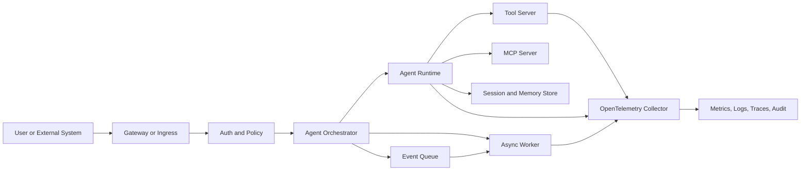

# Agentic Deployment Specification

This document is the normative draft for ADS v0.1. The supporting research notes live in [deployment-research.md](deployment-research.md); they are informative, not normative.

## Status

ADS is in draft status. v0.1 defines the problem, scope, vocabulary, and the first version of the conceptual document model. The concrete YAML schema is planned for v0.2 and the JSON Schema is planned for v0.3.

## Versioning Policy

ADS documents MUST declare the ADS specification version they target.

Draft versions MAY introduce breaking changes. Stable versions MUST preserve backward compatibility within the same major version unless a field is explicitly marked as deprecated and removed in a later major version.

## Conformance Language

The key words MUST, MUST NOT, SHOULD, SHOULD NOT, and MAY are to be interpreted as normative requirement levels.

An ADS processor is any tool, agent, or platform component that reads an ADS document and attempts to validate, plan, deploy, or operate the described system.

## Problem Statement

Deployment agents and platform teams often need to infer operational requirements from source code, README files, framework conventions, or handwritten deployment notes. That inference is fragile for agentic systems because they often combine model calls, tools, memory, queues, policy gates, human approvals, secrets, and external services.

ADS defines a deployment contract that lets an application state its operational intent directly.

## Goals

- Define a vendor-neutral contract for deploying and operating self-hosted applications and agentic systems.
- Make runtime components, capabilities, security requirements, approvals, and observability requirements explicit.
- Support both human review and automated validation.
- Allow multiple infrastructure targets, including Kubernetes, Docker Compose, managed container platforms, and GitOps workflows.
- Provide a path from a minimal single-agent deployment to production multi-agent systems.

## Non-Goals

- ADS does not replace Kubernetes manifests, Helm charts, Terraform modules, CI/CD pipelines, or secrets managers.
- ADS does not define an agent framework, model API, prompt format, or tool protocol.
- ADS does not mandate a single cloud, orchestrator, model provider, observability backend, or policy engine.
- ADS does not store secret values inline.

## Scope

ADS covers the declaration of deployment intent and operational requirements. It includes:

- runtime components and execution modes
- required platform capabilities
- state, memory, queue, and storage requirements
- network and trust boundaries
- secret references and rotation expectations
- security, policy, and human-approval requirements
- observability, audit, and readiness requirements
- compatibility profiles for common deployment targets

## Terminology

ADS document
: A machine-readable file that declares the deployment contract for an application or agentic system.

Runtime component
: A deployable unit such as an API service, agent runtime, worker, tool server, MCP server, queue consumer, or observability collector.

Capability
: A platform feature required by the deployment, such as persistent storage, GPU scheduling, outbound allowlists, network policy, secret injection, or trace export.

Approval gate
: A declared point where a human or policy system must approve an action before it proceeds.

ADS processor
: A deployment agent, validation tool, platform controller, or CI/CD job that reads and acts on an ADS document.

Profile
: A named compatibility target that constrains how ADS requirements map to a platform, such as `compose-single-host` or `kubernetes-production`.

## Document Model

An ADS document MUST declare:

- `apiVersion`: the ADS specification version.
- `kind`: the document kind. v0.1 defines `AgenticDeployment`.
- `metadata`: name, owner, and optional labels.
- `runtime`: deployable components and execution modes.
- `capabilities`: platform capabilities required to satisfy the deployment.
- `security`: trust boundaries, sandboxing, identity, and hardening requirements.
- `secrets`: references to required secrets without inline secret values.
- `approvals`: actions that require human or policy approval.
- `observability`: metrics, logs, traces, and audit events required for operations.

An ADS document SHOULD declare:

- `profiles`: compatible target environments.
- `networking`: ingress, egress, and service exposure requirements.
- `reliability`: health checks, rollout, rollback, timeout, retry, and dead-letter behavior.
- `extensions`: namespaced fields for experimental or vendor-specific features.

An ADS processor MUST reject a document when it omits required fields or declares a required capability the target platform cannot satisfy.

## Minimal Example

This example is intentionally small and should be reused as the baseline for future standalone examples.

```yaml
apiVersion: ads.dev/v0alpha1
kind: AgenticDeployment
metadata:
  name: support-agent
  owner: platform-team
  labels:
    tier: production

profiles:
  - kubernetes-production
  - compose-single-host

runtime:
  components:
    - name: api
      type: agent-runtime
      image: ghcr.io/example/support-agent:1.0.0
      execution:
        mode: request-response
        concurrency: 8
      ports:
        - name: http
          containerPort: 8080
      state:
        mode: durable-session
        store: postgres
    - name: tool-server
      type: tool-server
      image: ghcr.io/example/support-tools:1.0.0
      execution:
        mode: internal-service

capabilities:
  required:
    - secret-injection
    - persistent-storage
    - outbound-egress-policy
    - trace-export

secrets:
  required:
    - name: model-api-key
      purpose: model-provider-auth
      rotation: required
    - name: database-url
      purpose: session-state
      rotation: required

security:
  defaultSandbox: restricted
  outbound:
    default: deny
    allow:
      - api.openai.com
      - internal.crm.example
  toolPolicy:
    default: deny
    allow:
      - read-ticket
      - draft-reply

approvals:
  required:
    - action: send-customer-email
      mode: human
      reason: external side effect
    - action: mutate-crm-record
      mode: policy-and-human
      reason: privileged business data

observability:
  traces:
    required: true
    format: opentelemetry
  metrics:
    required:
      - request_latency
      - tool_call_count
      - approval_wait_time
      - model_cost
  auditEvents:
    required:
      - deployment_planned
      - tool_call_denied
      - approval_granted
      - secret_resolved
```

## Runtime Model

ADS models an agentic system as multiple cooperating runtime components rather than a single container. Components MAY include API services, agent runtimes, workflow orchestrators, tool servers, MCP servers, async workers, queues, state stores, vector stores, gateways, and observability collectors.

Each runtime component MUST declare its component type and execution mode. Components that maintain state SHOULD declare whether that state is ephemeral, checkpointed, or durable.



## Capability Model

Capabilities describe what the target platform must provide. v0.1 defines capability families but does not yet define the final schema.

Core capability families are:

- runtime: containers, jobs, scheduled tasks, concurrency, and process lifecycle.
- state: persistent volumes, databases, vector stores, queues, and checkpointing.
- security: identity, sandboxing, RBAC, network policy, and image verification.
- secrets: external secret references, injection method, and rotation behavior.
- observability: metrics, logs, traces, audit events, and alert hooks.
- scaling: horizontal scaling, event-driven scaling, GPU scheduling, and idle scale-down.
- delivery: rollout, rollback, progressive delivery, and GitOps reconciliation.

## Security Model

ADS security is deny-by-default. A deployment SHOULD start with minimal privileges and explicitly opt into broader access.

An ADS document MUST describe:

- trust boundaries between users, agents, tools, data stores, and external services
- tool allowlists for agent-triggered actions
- sandboxing expectations for code execution, file access, browsers, and tool servers
- identity and authorization requirements for services and human operators
- audit events for security-relevant actions

A production profile SHOULD require non-root containers, least-privilege service accounts, restricted runtime settings, network egress controls, and signed deployment artifacts.

## Secrets Model

ADS documents MUST NOT contain secret values. They MUST reference required secrets by name, purpose, and expected lifecycle.

A secret declaration SHOULD describe:

- purpose
- source class, such as external secret store or encrypted GitOps value
- injection method
- rotation expectation
- restart or hot-reload behavior after rotation

Native platform secrets MAY be used as a delivery mechanism, but ADS treats the source of truth and rotation policy as separate requirements.

## Networking Model

Networking declarations SHOULD distinguish ingress, internal service traffic, and outbound egress. Production deployments SHOULD default to denied outbound traffic and explicitly allow required destinations.

ADS processors SHOULD surface unresolved networking requirements before deployment planning completes.

## Observability Model

Agentic systems require both conventional service telemetry and agent-specific telemetry. ADS documents MUST declare the telemetry signals required to operate the system safely.

Required observability MAY include:

- metrics for latency, success rate, retries, rate limits, queue depth, and model cost
- logs for component lifecycle and security-relevant events
- traces for model calls, tool calls, handoffs, and workflow runs
- audit events for approvals, denied actions, secret resolution, and deployment changes

OpenTelemetry SHOULD be the default interchange format for traces and metrics when the target platform supports it.

## Approval and Policy Model

ADS treats approvals as part of the deployment contract. Any action with external side effects, privileged data access, irreversible mutation, or high cost SHOULD be modeled as an approval-gated action.

Approval declarations SHOULD specify:

- action name
- approval mode: human, policy, or policy-and-human
- reason
- scope
- audit event requirements

Policy engines MAY evaluate approval decisions, but ADS does not mandate a specific policy engine.

## Deployment Profiles

Profiles constrain the mapping from ADS requirements to a target environment.

v0.1 recognizes these draft profile names:

- `compose-single-host`: local, development, or small single-host deployment.
- `kubernetes-production`: production deployment on Kubernetes-compatible platforms.
- `managed-container-runtime`: managed services such as ECS, Cloud Run, or Azure Container Apps.
- `serverless-auxiliary`: event handlers, hooks, scheduled jobs, and burst workers.
- `air-gapped`: environments without direct external network access.
- `gpu-serving`: deployments requiring accelerator-aware scheduling.

Profiles MUST NOT weaken required security, approval, or observability declarations. If a profile cannot satisfy a requirement, the ADS processor MUST report an incompatibility.

## Compatibility Rules

ADS processors MUST report:

- unsupported required capabilities
- missing secret bindings
- missing approval handlers
- unresolved network destinations
- unavailable observability sinks
- platform limitations that alter the declared runtime model

ADS processors MAY ignore unknown extension fields only when those fields are namespaced and not marked as required.

## Schema Mapping

The v0.2 milestone will define the YAML field structure. The v0.3 milestone will provide a JSON Schema for validation.

The schema SHOULD preserve this document's separation between intent and implementation-specific manifests.

## Examples

The minimal example in this document is the current canonical example. Future examples SHOULD reuse its names and structure where possible, extending it for multi-agent, stateful, GPU, and air-gapped scenarios instead of inventing unrelated examples.

## Extension Registry

Extensions MUST use a namespaced key to avoid collisions. Vendor-specific extensions MUST NOT redefine normative ADS fields.

The extension registry format is deferred until v0.4.

## Change Log

- v0.1 draft: defined problem statement, goals, non-goals, vocabulary, conceptual document model, runtime model, security model, approval model, and profile names.
