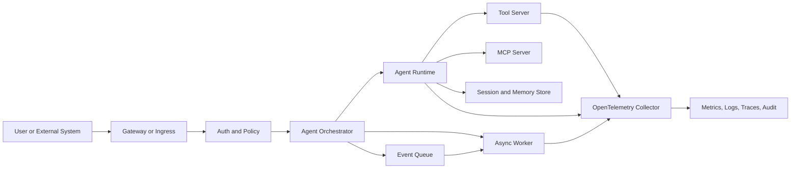
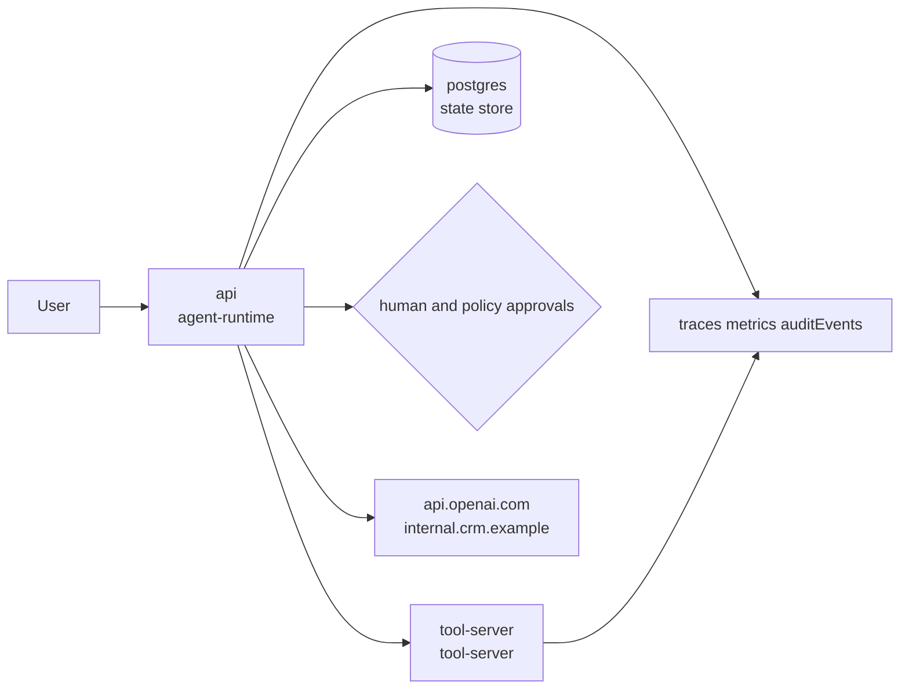
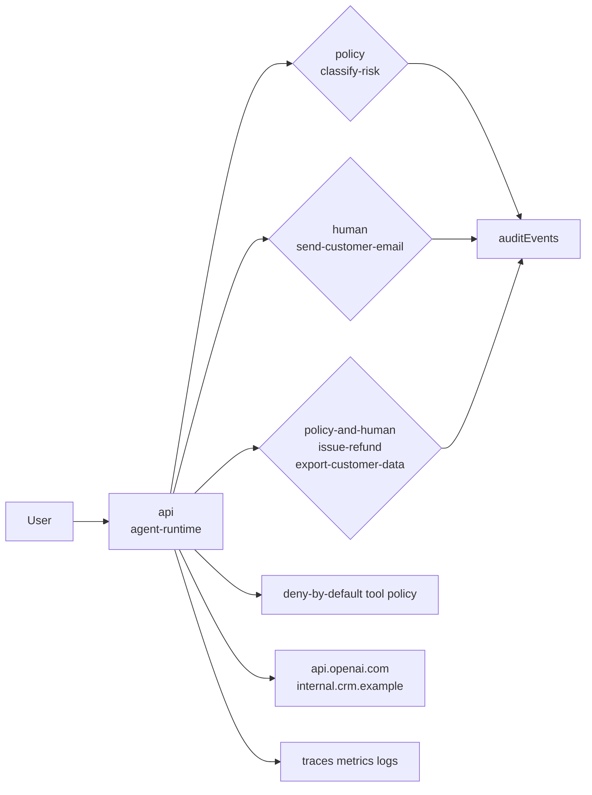
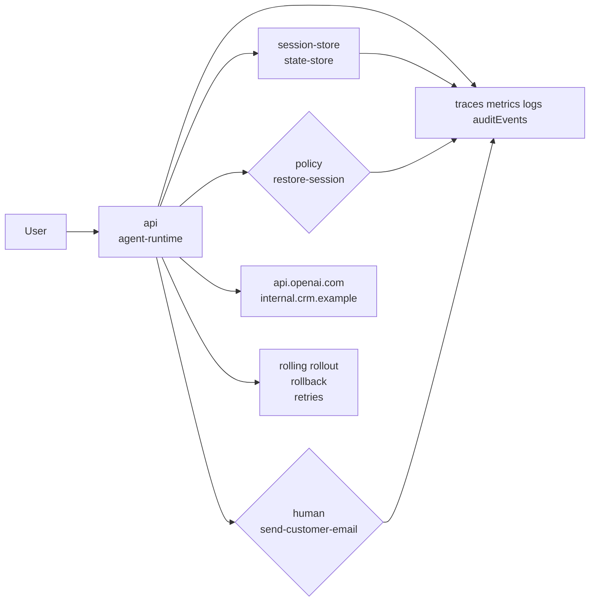
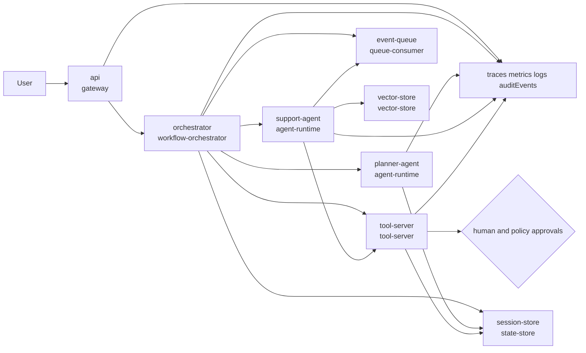

# Agentic Deployment Specification

This document is the normative draft for ADS. The supporting research notes live in [deployment-research.md](deployment-research.md); they are informative, not normative.

## Status

ADS is in draft status. v0.1 defines the problem, scope, vocabulary, and the first version of the conceptual document model. v0.2 defines the concrete YAML authoring format. v0.3 starts the machine-validatable schema and processor conformance work.

## Versioning Policy

ADS documents MUST declare the ADS API version they target.

Draft API versions use the `ads.dev/v0alphaN` form. The v0.2 YAML authoring draft uses `ads.dev/v0alpha1`; future drafts MAY increment the API version when the authoring format changes incompatibly.

Draft versions MAY introduce breaking changes. Stable versions MUST preserve backward compatibility within the same major version unless a field is explicitly marked as deprecated and removed in a later major version.

## Conformance Language

The key words MUST, MUST NOT, SHOULD, SHOULD NOT, and MAY are to be interpreted as normative requirement levels.

An ADS processor is any tool, agent, or platform component that reads an ADS document and attempts to validate, plan, deploy, or operate the described system.

## Problem Statement

Deployment agents and platform teams often need to infer operational requirements from source code, README files, framework conventions, or handwritten deployment notes. That inference is fragile for agentic systems because they often combine model calls, tools, memory, queues, policy gates, human approvals, secrets, and external services.

ADS defines a deployment contract that lets an application state its operational intent directly.

## Goals

- Define a vendor-neutral contract for deploying and operating self-hosted applications and agentic systems.
- Make runtime components, capabilities, security requirements, approvals, and observability requirements explicit.
- Support both human review and automated validation.
- Allow multiple infrastructure targets, including Kubernetes, Docker Compose, managed container platforms, and GitOps workflows.
- Provide a path from a minimal single-agent deployment to production multi-agent systems.

## Non-Goals

- ADS does not replace Kubernetes manifests, Helm charts, Terraform modules, CI/CD pipelines, or secrets managers.
- ADS does not define an agent framework, model API, prompt format, or tool protocol.
- ADS does not mandate a single cloud, orchestrator, model provider, observability backend, or policy engine.
- ADS does not store secret values inline.

## Scope

ADS covers the declaration of deployment intent and operational requirements. It includes:

- runtime components and execution modes
- required platform capabilities
- state, memory, queue, and storage requirements
- network and trust boundaries
- secret references and rotation expectations
- security, policy, and human-approval requirements
- observability, audit, and readiness requirements
- compatibility profiles for common deployment targets

## Terminology

ADS document
: A machine-readable file that declares the deployment contract for an application or agentic system.

Runtime component
: A deployable unit such as an API service, agent runtime, worker, tool server, MCP server, queue consumer, or observability collector.

Capability
: A platform feature required by the deployment, such as persistent storage, GPU scheduling, outbound allowlists, network policy, secret injection, or trace export.

Approval gate
: A declared point where a human or policy system must approve an action before it proceeds.

ADS processor
: A deployment agent, validation tool, platform controller, or CI/CD job that reads and acts on an ADS document.

Profile
: A named compatibility target that constrains how ADS requirements map to a platform, such as `compose-single-host` or `kubernetes-production`.

Target context
: The selected deployment target and its available profile, platform capabilities, external integrations, secret bindings, approval handlers, network controls, and observability sinks.

## Document Model

An ADS document MUST declare:

- `apiVersion`: the ADS API version.
- `kind`: the document kind. v0.2 defines `AgenticDeployment`.
- `metadata`: name, owner, and optional labels.
- `runtime`: deployable components and execution modes.
- `capabilities`: platform capabilities required to satisfy the deployment.
- `security`: trust boundaries, sandboxing, identity, and hardening requirements.
- `secrets`: references to required secrets without inline secret values.
- `approvals`: actions that require human or policy approval.
- `observability`: metrics, logs, traces, and audit events required for operations.

An ADS document SHOULD declare:

- `profiles`: compatible target environments.
- `networking`: ingress, egress, and service exposure requirements.
- `reliability`: health checks, rollout, rollback, timeout, retry, and dead-letter behavior.
- `extensions`: namespaced fields for experimental or vendor-specific features.

An ADS processor MUST reject a document when it omits required fields or declares a required capability the target platform cannot satisfy.

## YAML Document Structure

The v0.2 authoring format for ADS is YAML. The initial JSON Schema for this structure is tracked as v0.3 work, but the field structure in this section remains normative for `AgenticDeployment` documents.

An ADS YAML document MUST be a mapping with these root fields:

| Field | Required | Type | Description |
|---|---:|---|---|
| `apiVersion` | yes | string | ADS API version. The current draft examples use `ads.dev/v0alpha1`. |
| `kind` | yes | string | Document kind. v0.2 defines `AgenticDeployment`. |
| `metadata` | yes | object | Human and machine metadata for the deployment contract. |
| `profiles` | no | list of strings | Target compatibility profiles the author expects to support. |
| `runtime` | yes | object | Runtime components and execution modes. |
| `capabilities` | yes | object | Required and optional platform capabilities. |
| `secrets` | yes | object | Secret references and lifecycle requirements. |
| `security` | yes | object | Trust, sandboxing, identity, network, and tool policy requirements. |
| `approvals` | yes | object | Human or policy approval gates. |
| `observability` | yes | object | Required telemetry and audit signals. |
| `networking` | no | object | Ingress, internal service, and egress declarations. |
| `reliability` | no | object | Health, rollout, rollback, retry, timeout, and dead-letter behavior. |
| `extensions` | no | object | Namespaced extension fields. |

### `metadata`

`metadata` MUST include:

- `name`: stable deployment name.
- `owner`: team, person, or service owner responsible for the deployment.

`metadata` MAY include:

- `description`: short human-readable description.
- `labels`: string key-value labels for filtering and policy.
- `annotations`: string key-value metadata that processors MAY ignore.

`metadata.name` SHOULD be stable across environments. Labels and annotations MUST NOT contain secret values.

### `runtime`

`runtime.components` MUST be a non-empty list. Each component MUST include:

- `name`: component name, unique within `runtime.components`.
- `type`: component role.
- `execution.mode`: execution mode.
- `image` or `externalRef`: the deployable image or externally managed component reference.

Component `type` values defined by v0.2 are:

- `api-service`
- `agent-runtime`
- `workflow-orchestrator`
- `worker`
- `tool-server`
- `mcp-server`
- `queue-consumer`
- `state-store`
- `vector-store`
- `gateway`
- `observability-collector`
- `job`
- `scheduled-task`
- `custom`

`execution.mode` values defined by v0.2 are:

- `request-response`
- `internal-service`
- `async-worker`
- `event-driven`
- `scheduled`
- `job`
- `daemon`
- `external`

Components MAY include:

- `ports`: list of named ports with `containerPort`, optional `protocol`, and optional `exposure`.
- `dependsOn`: list of component names that must be available first.
- `state`: state mode and backing store.
- `resources`: CPU, memory, and accelerator requirements.
- `health`: liveness, readiness, and startup probe declarations.
- `scaling`: replica and scaling trigger declarations.
- `config`: non-secret configuration values.

`state.mode` values defined by v0.2 are `stateless`, `ephemeral`, `checkpointed`, `durable-session`, and `durable-shared`. Components that maintain state SHOULD declare `state.mode`. Components using `checkpointed`, `durable-session`, or `durable-shared` state SHOULD declare `state.store`.

### `capabilities`

`capabilities.required` MUST be a list. The list MAY be empty only when the document has no platform requirements beyond running the declared components.

Each capability entry MAY be either:

- a string capability name, such as `secret-injection`; or
- an object with `name` and optional `for`, `level`, and `reason` fields.

Processors MUST normalize string entries to objects with the same `name`. `capabilities.optional` MAY use the same entry format.

v0.2 reserves these capability names:

- `container-runtime`
- `secret-injection`
- `persistent-storage`
- `queue`
- `vector-store`
- `network-policy`
- `outbound-egress-policy`
- `trace-export`
- `metrics-export`
- `audit-log-export`
- `human-approval`
- `policy-decision`
- `horizontal-scaling`
- `event-driven-scaling`
- `rollback`
- `dead-letter-queue`
- `image-signature-verification`
- `gpu-scheduling`

Future drafts MAY add capability names. Vendor-specific capability names MUST be namespaced.

### `secrets`

`secrets.required` MUST be a list. The list MAY be empty.

Each required secret MUST include:

- `name`: local secret reference name.
- `purpose`: reason the secret is needed.
- `rotation`: one of `required`, `recommended`, `manual`, or `not-supported`.

Each required secret MAY include:

- `source`: source class, such as `external-secret-store`, `encrypted-gitops-value`, or `platform-secret`.
- `injection`: injection method, such as `env`, `file`, `volume`, or `runtime-fetch`.
- `reload`: one of `hot-reload`, `restart-required`, or `not-applicable`.
- `for`: component names that consume the secret.

ADS documents MUST NOT include secret values, encrypted secret payloads, private keys, tokens, passwords, or credentials in any field.

### `security`

`security` MUST include:

- `defaultSandbox`: default sandbox level.
- `toolPolicy.default`: default tool decision.

`defaultSandbox` values defined by v0.2 are `restricted`, `baseline`, and `privileged`. Production deployments SHOULD use `restricted`.

`toolPolicy.default` MUST be `deny` or `allow`. Production deployments SHOULD use `deny`. `toolPolicy.allow` and `toolPolicy.deny` MAY list tool names or action names. Tool names SHOULD be stable identifiers, not human prose.

`security` MAY include:

- `outbound.default`: `deny` or `allow`.
- `outbound.allow`: list of allowed hostnames, domains, CIDR ranges, or service names.
- `identity`: service and operator identity requirements.
- `trustBoundaries`: named boundaries between users, agents, tools, data stores, and external services.
- `hardening`: runtime hardening requirements such as non-root containers, read-only filesystems, seccomp, AppArmor, SELinux, and image verification.

### `approvals`

`approvals.required` MUST be a list. The list MAY be empty.

Each required approval MUST include:

- `action`: stable action name.
- `mode`: one of `human`, `policy`, or `policy-and-human`.
- `reason`: human-readable reason for the approval gate.

Each required approval MAY include:

- `scope`: component, tool, environment, data class, or operation scope.
- `handlerRef`: external approval or ticketing system reference.
- `auditEvents`: audit event names that must be emitted for this approval.

### `observability`

`observability` MUST declare the telemetry signals required to operate the system safely.

`observability.traces` SHOULD include:

- `required`: boolean.
- `format`: trace interchange format, such as `opentelemetry`.

`observability.metrics.required` MUST be a list. The list MAY be empty only for non-production documents.

`observability.auditEvents.required` MUST be a list of audit event names. The list MAY be empty only when no security-relevant, secret, approval, deployment, or tool events are declared.

Audit event names MUST be either standard ADS audit event names from the audit event taxonomy or namespaced extension names.

`observability.logs` MAY declare required log streams, retention expectations, and redaction requirements.

### `networking`

`networking` MAY include:

- `ingress`: externally reachable routes, ports, TLS, and authentication expectations.
- `internal`: service-to-service traffic requirements.
- `egress`: outbound destinations and default behavior.

If both `security.outbound` and `networking.egress` are present, they MUST NOT conflict.

### `reliability`

`reliability` MAY include:

- `rollout`: deployment strategy such as `rolling`, `blue-green`, or `canary`.
- `rollback`: rollback trigger and target behavior.
- `timeouts`: default timeout requirements.
- `retries`: retry count, backoff, and jitter requirements.
- `rateLimits`: request, tool, model, or queue rate limits.
- `deadLetters`: dead-letter behavior for queue or event-driven components.

Component-level `health` declarations SHOULD be used for component probes. Top-level `reliability` SHOULD describe cross-component behavior.

### `extensions`

Extension keys MUST be namespaced, for example `example.com/feature` or `x-example/feature`. Extensions MUST NOT redefine the meaning of normative ADS fields.

## Minimal Example

This example is intentionally small and should be reused as the baseline for future standalone examples.

```yaml
apiVersion: ads.dev/v0alpha1
kind: AgenticDeployment
metadata:
  name: support-agent
  owner: platform-team
  labels:
    tier: production

profiles:
  - kubernetes-production
  - compose-single-host
  - managed-container-runtime

runtime:
  components:
    - name: api
      type: agent-runtime
      image: ghcr.io/example/support-agent:1.0.0
      execution:
        mode: request-response
        concurrency: 8
      ports:
        - name: http
          containerPort: 8080
      state:
        mode: durable-session
        store: postgres
    - name: tool-server
      type: tool-server
      image: ghcr.io/example/support-tools:1.0.0
      execution:
        mode: internal-service

capabilities:
  required:
    - secret-injection
    - persistent-storage
    - outbound-egress-policy
    - trace-export
    - metrics-export
    - audit-log-export
    - human-approval
    - policy-decision

secrets:
  required:
    - name: model-api-key
      purpose: model-provider-auth
      rotation: required
    - name: database-url
      purpose: session-state
      rotation: required

security:
  defaultSandbox: restricted
  outbound:
    default: deny
    allow:
      - api.openai.com
      - internal.crm.example
  toolPolicy:
    default: deny
    allow:
      - read-ticket
      - draft-reply

approvals:
  required:
    - action: send-customer-email
      mode: human
      reason: external side effect
    - action: mutate-crm-record
      mode: policy-and-human
      reason: privileged business data

observability:
  traces:
    required: true
    format: opentelemetry
  metrics:
    required:
      - request_latency
      - tool_call_count
      - approval_wait_time
      - model_cost
  auditEvents:
    required:
      - deployment_planned
      - policy_decision_recorded
      - approval_requested
      - tool_call_denied
      - approval_granted
      - approval_denied
      - secret_resolved
```

## Runtime Model

ADS models an agentic system as multiple cooperating runtime components rather than a single container. Components MAY include API services, agent runtimes, workflow orchestrators, tool servers, MCP servers, async workers, queues, state stores, vector stores, gateways, and observability collectors.

Each runtime component MUST declare its component type and execution mode. Components that maintain state SHOULD declare whether that state is ephemeral, checkpointed, or durable.



## Capability Model

Capabilities describe what the target platform must provide. v0.2 defines initial capability names for YAML authors while retaining the capability families below as the conceptual grouping.

Core capability families are:

- runtime: containers, jobs, scheduled tasks, concurrency, and process lifecycle.
- state: persistent volumes, databases, vector stores, queues, and checkpointing.
- security: identity, sandboxing, RBAC, network policy, and image verification.
- secrets: external secret references, injection method, and rotation behavior.
- observability: metrics, logs, traces, audit events, and alert hooks.
- scaling: horizontal scaling, event-driven scaling, GPU scheduling, and idle scale-down.
- delivery: rollout, rollback, progressive delivery, and GitOps reconciliation.

## Security Model

ADS security is deny-by-default. A deployment SHOULD start with minimal privileges and explicitly opt into broader access.

An ADS document MUST describe:

- trust boundaries between users, agents, tools, data stores, and external services
- tool allowlists for agent-triggered actions
- sandboxing expectations for code execution, file access, browsers, and tool servers
- identity and authorization requirements for services and human operators
- audit events for security-relevant actions

A production profile SHOULD require non-root containers, least-privilege service accounts, restricted runtime settings, network egress controls, and signed deployment artifacts.

## Secrets Model

ADS documents MUST NOT contain secret values. They MUST reference required secrets by name, purpose, and expected lifecycle.

A secret declaration SHOULD describe:

- purpose
- source class, such as external secret store or encrypted GitOps value
- injection method
- rotation expectation
- restart or hot-reload behavior after rotation

Native platform secrets MAY be used as a delivery mechanism, but ADS treats the source of truth and rotation policy as separate requirements.

## Networking Model

Networking declarations SHOULD distinguish ingress, internal service traffic, and outbound egress. Production deployments SHOULD default to denied outbound traffic and explicitly allow required destinations.

ADS processors SHOULD surface unresolved networking requirements before deployment planning completes.

## Observability Model

Agentic systems require both conventional service telemetry and agent-specific telemetry. ADS documents MUST declare the telemetry signals required to operate the system safely.

Required observability MAY include:

- metrics for latency, success rate, retries, rate limits, queue depth, and model cost
- logs for component lifecycle and security-relevant events
- traces for model calls, tool calls, handoffs, and workflow runs
- audit events for approvals, denied actions, secret resolution, and deployment changes

OpenTelemetry SHOULD be the default interchange format for traces and metrics when the target platform supports it.

## Audit Event Taxonomy

ADS audit events are stable machine-readable event names that describe security-relevant deployment, policy, approval, secret, tool, network, and state activity. ADS documents declare the audit events that must be emitted; target contexts declare whether an audit sink is available.

Standard ADS audit event names are reserved by this specification. Event names that are not standard ADS names MUST be namespaced, using the same namespace rule as extensions, for example `example.com/risk_classification_recorded`.

Standard ADS audit events are:

| Category | Standard audit event names |
|---|---|
| Deployment | `deployment_planned`, `deployment_applied`, `deployment_failed`, `deployment_rolled_back` |
| Approval | `approval_requested`, `approval_granted`, `approval_denied`, `approval_expired` |
| Policy | `policy_evaluated`, `policy_decision_recorded` |
| Secret | `secret_resolved`, `secret_rotation_due`, `secret_rotation_completed`, `secret_rotation_failed` |
| Tool and action | `tool_call_requested`, `tool_call_allowed`, `tool_call_denied`, `tool_call_executed`, `action_executed` |
| Network | `egress_allowed`, `egress_denied` |
| State | `state_checkpoint_written`, `state_restore_started`, `state_restore_completed`, `state_restore_failed` |

Audit event payloads SHOULD include the event name, timestamp, deployment name, component name when applicable, actor or service identity when known, action or target when applicable, decision or outcome, reason, and correlation identifier. Audit event payloads MUST NOT include secret values, credentials, tokens, private keys, or decrypted secret payloads.

Production ADS documents SHOULD include `deployment_planned`. Documents with required secrets SHOULD include `secret_resolved`. Documents with human approval gates SHOULD include `approval_requested`, `approval_granted`, and `approval_denied`. Documents with policy approval gates SHOULD include `policy_decision_recorded`. Documents with deny-by-default tool policy or explicit tool deny rules SHOULD include `tool_call_denied`.

## Approval and Policy Model

ADS treats approvals as part of the deployment contract. Any action with external side effects, privileged data access, irreversible mutation, or high cost SHOULD be modeled as an approval-gated action.

Approval declarations SHOULD specify:

- action name
- approval mode: human, policy, or policy-and-human
- reason
- scope
- audit event requirements

Policy engines MAY evaluate approval decisions, but ADS does not mandate a specific policy engine.

## Deployment Profiles

Profiles constrain the mapping from ADS requirements to a target environment.

v0.2 recognizes these draft profile names:

- `compose-single-host`: local, development, or small single-host deployment.
- `kubernetes-production`: production deployment on Kubernetes-compatible platforms.
- `managed-container-runtime`: managed services such as ECS, Cloud Run, or Azure Container Apps.
- `serverless-auxiliary`: event handlers, hooks, scheduled jobs, and burst workers.
- `air-gapped`: environments without direct external network access.
- `gpu-serving`: deployments requiring accelerator-aware scheduling.

Profiles MUST NOT weaken required security, approval, or observability declarations. If a profile cannot satisfy a requirement, the ADS processor MUST report an incompatibility.

### Initial Profile Compatibility Notes

`compose-single-host` is intended for local, development, or small single-host deployments. It SHOULD be able to satisfy basic container runtime, port exposure, environment-based secret injection, bind or volume storage, and simple restart behavior. It SHOULD NOT be assumed to satisfy cluster scheduling, service-account RBAC, admission control, horizontal autoscaling, native network policy, signed-artifact enforcement, or default-deny egress without additional external controls.

`kubernetes-production` is intended for production Kubernetes-compatible environments. It SHOULD be able to satisfy container runtime, probes, rollouts, rollback, service discovery, service identity, RBAC, secret delivery, persistent volumes, network policy, horizontal scaling, and workload isolation when the cluster is configured with the required controllers and policies. It MUST report an incompatibility when required add-ons or integrations are absent, including trace export, external secret stores, policy decision points, approval handlers, GPU scheduling, signed-artifact verification, or egress controls.

### Draft Profile Capability Matrix

The profile matrix is informative guidance for authors and processor implementers. A profile describes a deployment target class; it does not by itself prove that a specific target environment can satisfy a requirement. ADS processors MUST use the selected target context to confirm the concrete capability set, secret bindings, approval handlers, observability sinks, network controls, and security controls available for deployment planning.

| Profile | Expected core capabilities | Common limits | Current example coverage |
|---|---|---|---|
| `compose-single-host` | `container-runtime`, `secret-injection`, `persistent-storage`, basic `trace-export`, `metrics-export`, `audit-log-export`, local `human-approval`, local `policy-decision` | Should not be assumed to provide native `network-policy`, `horizontal-scaling`, admission control, signed artifact enforcement, cluster RBAC, or production-grade default-deny egress without external controls. | `examples/minimal.yaml` and `examples/approval-policy.yaml` are expected to pass against `contexts/compose-single-host.yaml`; `examples/stateful-agent.yaml` and `examples/multi-agent.yaml` are expected to fail with compatibility diagnostics. |
| `kubernetes-production` | `container-runtime`, `secret-injection`, `persistent-storage`, `queue`, `vector-store`, `network-policy`, `outbound-egress-policy`, `trace-export`, `metrics-export`, `audit-log-export`, `human-approval`, `policy-decision`, `horizontal-scaling`, `rollback` | Requires configured add-ons and integrations for external secrets, policy decisions, approval workflows, egress control, telemetry export, image verification, GPU scheduling, and event-driven scaling. | `examples/minimal.yaml`, `examples/approval-policy.yaml`, `examples/stateful-agent.yaml`, and `examples/multi-agent.yaml` are expected to pass against `contexts/kubernetes-production.yaml`. |
| `managed-container-runtime` | `container-runtime`, `secret-injection`, `persistent-storage`, `outbound-egress-policy`, basic service identity, observability export, managed rollout, and managed horizontal scaling | May have limited control over sidecars, native network policy, queues, vector stores, dead-letter queues, custom admission policy, background workers, and local tool-server isolation. | `examples/minimal.yaml`, `examples/approval-policy.yaml`, and `examples/stateful-agent.yaml` are expected to pass against `contexts/managed-container-runtime.yaml`; `examples/multi-agent.yaml` is expected to fail until the target context declares additional external integrations. |
| `serverless-auxiliary` | Scheduled jobs, event handlers, short-lived workers, secret injection, platform logs, metrics, and managed retry behavior | May not preserve long-running sessions, durable in-process memory, custom networking, local tool servers, or low-latency agent handoffs. | Planned for auxiliary hooks, scheduled tasks, and burst worker examples. |
| `air-gapped` | Local artifact sources, internal secret stores, internal observability sinks, restricted egress controls, policy enforcement, and audit export to local systems | Cannot depend on public model APIs, public container registries, hosted approval systems, or external telemetry endpoints unless mirrored internally. | Planned for a future profile fixture after network and artifact-source rules are expanded. |
| `gpu-serving` | `gpu-scheduling`, accelerator-aware resources, container runtime, model artifact access, metrics, traces, and workload isolation | Requires target-specific node pools, device plugins, model cache policy, quota controls, and cost governance. | Planned for a future stateful or model-serving example. |

Conformance fixtures SHOULD encode both positive and negative profile expectations. A richer example SHOULD pass against at least one production-capable target context and fail against at least one smaller target context when it requires capabilities that the smaller context does not claim to provide.

## Compatibility Rules

ADS processors MUST report:

- unsupported required capabilities
- missing secret bindings
- missing approval handlers
- unresolved network destinations
- unavailable observability sinks
- platform limitations that alter the declared runtime model

ADS processors MAY ignore unknown extension fields only when those fields are namespaced and not marked as required.

## Production Readiness Checklist

This checklist is initial v0.5 guidance for authors, reviewers, and ADS processors. A production ADS document SHOULD be reviewed against these expectations before deployment planning is approved.

| Area | Production readiness expectation | Related fields |
|---|---|---|
| Ownership | The deployment has a stable name, an accountable owner, and explicit target profiles. | `metadata.name`, `metadata.owner`, `profiles` |
| Runtime model | Runtime components, execution modes, dependencies, health checks, and externally managed components are explicit. | `runtime.components`, `execution`, `dependsOn`, `health`, `externalRef` |
| Capability compatibility | Required capabilities are complete, normalized, and satisfiable by the selected target context. Optional capabilities do not hide required production behavior. | `capabilities.required`, `capabilities.optional`, target context |
| Secrets | Secret values are never stored inline. Required secrets declare purpose, source class, injection method, rotation expectation, reload behavior, and consuming components when scoped. | `secrets.required` |
| Security defaults | Production deployments default to restricted sandboxing, deny-by-default tool policy, deny-by-default outbound policy when feasible, explicit trust boundaries, and hardening expectations. | `security.defaultSandbox`, `security.toolPolicy`, `security.outbound`, `security.trustBoundaries`, `security.hardening` |
| Approval and policy gates | Actions with external side effects, privileged data access, irreversible mutation, high cost, or compliance impact are approval-gated and mapped to available human and/or policy handlers. | `approvals.required`, target context approval handlers |
| Observability and audit | Required metrics, traces, logs, redaction expectations, and audit events are declared and bound to available sinks. Audit events cover deployment, approval, policy, secret, and tool activity. | `observability`, target context observability sinks |
| Networking | Ingress, internal traffic, outbound destinations, TLS/auth expectations, and default-deny egress requirements are declared and enforceable by the target context. | `networking`, `security.outbound`, target context network controls |
| Reliability | Health, rollout, rollback, retry, timeout, rate-limit, and dead-letter expectations are declared for the components that need them. | `runtime.components[].health`, `reliability` |
| Compatibility diagnostics | The processor reports all blocking incompatibilities without dropping, weakening, or replacing required ADS behavior with non-equivalent platform behavior. | diagnostics, target context |

Production readiness is not a separate deployment mode. It is the result of an ADS document, a target context, and an ADS processor agreeing on the same required behavior.

### v0.3 Processor Conformance

An ADS processor MUST evaluate an ADS document against a target context before deployment planning. The target context includes the selected target profile, the platform capability set, external integrations, secret bindings, approval handlers, network controls, and observability sinks available to the processor.

An ADS processor MUST complete these checks before it emits a deployment plan:

| Check | Requirement |
|---|---|
| Schema validation | The document MUST satisfy the structural requirements for its `apiVersion` and `kind`. |
| Reference resolution | Component names MUST be unique, and every `dependsOn`, component-scoped secret, and component-scoped capability reference MUST resolve to a declared component. |
| Capability normalization | String capability entries MUST be normalized to objects with `name` before compatibility checks. |
| Capability support | Every required capability MUST be satisfied by the target profile, the platform capability set, or an explicitly declared external integration. |
| Secret binding | Every `secrets.required` entry MUST have a binding in the target context before deployment. |
| Approval handling | Every required approval MUST have the human approval and/or policy decision handlers required by its `mode`. |
| Network feasibility | Required ingress, internal traffic, egress destinations, and default-deny outbound policies MUST be resolvable or enforceable by the target context. |
| Security feasibility | Sandbox, tool policy, identity, hardening, and trust-boundary requirements MUST NOT be silently weakened during planning. |
| Observability binding | Required traces, metrics, logs, and audit events MUST map to available sinks or explicitly declared external integrations. |
| Extension handling | Unknown extension fields MAY be ignored only when they are namespaced and not marked as required. |

An ADS processor MUST NOT emit a deployment plan when any required ADS behavior would be dropped, weakened, or replaced with a non-equivalent platform behavior. It MAY emit a partial diagnostic report instead.

An ADS processor SHOULD surface all detected errors in one validation response when practical, rather than stopping at the first error.

### Diagnostic Categories

ADS processors SHOULD emit diagnostics with stable machine-readable categories. A diagnostic SHOULD include `category`, `severity`, `message`, and a document `path`. A diagnostic MAY include `requirement`, `targetProfile`, `capability`, `component`, and `remediation`.

The initial diagnostic categories are:

| Category | Default severity | Meaning |
|---|---|---|
| `schema-invalid` | error | The document violates structural schema requirements. |
| `reference-invalid` | error | A component name, `dependsOn`, `for`, or scoped reference cannot be resolved. |
| `capability-unsupported` | error | A required capability is not supported by the selected target context. |
| `secret-unbound` | error | A required secret has no binding in the target context. |
| `approval-handler-missing` | error | A required human or policy approval handler is unavailable. |
| `network-unresolved` | error | A required network route, destination, exposure, or egress rule cannot be resolved or enforced. |
| `security-policy-unenforceable` | error | A sandbox, identity, hardening, outbound, or tool-policy requirement cannot be enforced. |
| `observability-sink-missing` | error | A required trace, metric, log, or audit sink is unavailable. |
| `audit-event-missing` | warning | A production, secret, approval, policy, or tool-policy requirement is missing its recommended audit event coverage. |
| `extension-unsupported` | error | A required extension is unknown or unsupported by the processor. |
| `processor-limitation` | error | The processor or target platform cannot preserve the declared runtime model. |
| `compatibility-warning` | warning | A non-blocking compatibility issue, such as an unknown non-extension root field or unsupported optional capability, was detected. |

Diagnostics MUST NOT include secret values, credentials, tokens, private keys, or decrypted secret payloads.

### v0.2 Validation Rules

Before deployment planning, an ADS processor MUST validate the YAML document against these rules:

- The root document MUST contain all required `AgenticDeployment` fields.
- `kind` MUST be `AgenticDeployment`.
- `metadata.name` and `metadata.owner` MUST be present and non-empty.
- `runtime.components` MUST contain at least one component.
- Component names MUST be unique.
- Every component MUST declare `type`, `execution.mode`, and either `image` or `externalRef`.
- Every `dependsOn` reference MUST match a declared component name.
- Every `ports[].containerPort` value MUST be an integer from 1 to 65535.
- `capabilities.required` MUST be normalized before compatibility checks.
- Every required capability MUST be supported by the target profile or explicitly satisfied by an external integration.
- A document with non-empty `secrets.required` SHOULD include the `secret-injection` required capability.
- A component with `checkpointed`, `durable-session`, or `durable-shared` state SHOULD include the `persistent-storage` required capability unless the state store is external.
- A document with `observability.traces.required: true` SHOULD include the `trace-export` required capability.
- A document with non-empty `observability.metrics.required` SHOULD include the `metrics-export` required capability.
- A document with required audit events SHOULD include the `audit-log-export` required capability.
- Every audit event name MUST be a standard ADS audit event name or a namespaced extension name.
- Production documents SHOULD include the `deployment_planned` audit event.
- Documents with required secrets SHOULD include the `secret_resolved` audit event.
- Documents with human approval gates SHOULD include the `approval_requested`, `approval_granted`, and `approval_denied` audit events.
- Documents with policy approval gates SHOULD include the `policy_decision_recorded` audit event.
- Documents with deny-by-default tool policy or explicit tool deny rules SHOULD include the `tool_call_denied` audit event.
- A document with `approvals.required` entries using `human` SHOULD include the `human-approval` required capability.
- A document with `approvals.required` entries using `policy` or `policy-and-human` SHOULD include the `policy-decision` required capability.
- A document with `security.outbound.default: deny` or `networking.egress.default: deny` SHOULD include the `outbound-egress-policy` required capability.
- `security.outbound` and `networking.egress` MUST NOT declare contradictory default behavior.
- Unknown non-extension root fields MUST be reported as compatibility warnings.
- Unknown extension fields MAY be ignored only when their keys are namespaced.

## Schema Mapping

The v0.2 milestone defines the YAML field structure. The initial v0.3 JSON Schema lives in [schemas/ads.schema.json](schemas/ads.schema.json).

The schema SHOULD preserve this document's separation between intent and implementation-specific manifests. It validates structural requirements that can be expressed directly in JSON Schema. Cross-reference and compatibility rules, including component-name uniqueness, `dependsOn` resolution, target-profile capability support, secret bindings, approval handlers, and observability sink availability, are defined as ADS processor conformance requirements.

## Examples

The minimal example in this document is the current canonical example. The standalone file [examples/minimal.yaml](examples/minimal.yaml) MUST remain equivalent to the canonical example in this section unless the example is intentionally revised. Future examples SHOULD reuse its names and structure where possible, extending it for multi-agent, stateful, GPU, and air-gapped scenarios instead of inventing unrelated examples.

### Example Architecture Diagrams

These diagrams are informative. Runtime component labels SHOULD match the component names used in the corresponding standalone examples.

#### Minimal Support Agent

This diagram summarizes the canonical minimal example in [examples/minimal.yaml](examples/minimal.yaml).



#### Approval And Policy Agent

This diagram summarizes [examples/approval-policy.yaml](examples/approval-policy.yaml), which exercises `policy`, `human`, and `policy-and-human` approval modes.



#### Stateful Agent

This diagram summarizes [examples/stateful-agent.yaml](examples/stateful-agent.yaml), which adds durable session state, managed rollback, and session restore policy.



#### Multi-Agent Suite

This diagram summarizes [examples/multi-agent.yaml](examples/multi-agent.yaml), the production-oriented multi-agent fixture.



The files in [examples/invalid/](examples/invalid/) are negative schema fixtures. They are intentionally invalid and MUST NOT be treated as conforming ADS documents.

The files in [examples/conformance/invalid/](examples/conformance/invalid/) are schema-valid negative conformance fixtures. They exercise document-level processor requirements that cannot be fully expressed in JSON Schema, such as component-name uniqueness and scoped reference resolution.

## Extension Registry

Extensions MUST use a namespaced key to avoid collisions. Vendor-specific extensions MUST NOT redefine normative ADS fields.

The extension registry format is deferred until v0.4.

## Change Log

- v0.3 draft: added the initial JSON Schema, negative schema fixtures, processor conformance requirements, diagnostic categories, and a reference conformance-check fixture harness.
- v0.2 draft: defined the YAML authoring structure, initial validation rules, and first profile compatibility notes.
- v0.1 draft: defined problem statement, goals, non-goals, vocabulary, conceptual document model, runtime model, security model, approval model, and profile names.
