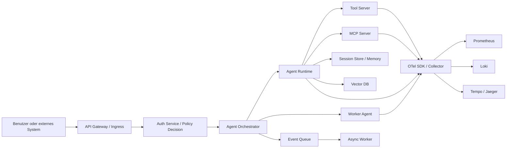
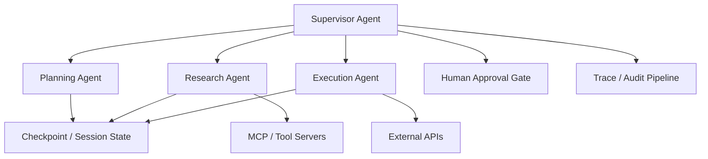

# Deployment Research Reference for agentic-deployment-spec

> Non-normative technical research reference. This report describes the repository state at the time of research and was used to shape the current draft. The normative draft specification lives in [SPEC.md](SPEC.md), and the repository entry point lives in [README.md](README.md).

## Executive Summary und Diagnose

Das Repository **panndabea/agentic-deployment-spec** ist aktuell tatsächlich noch ein sehr früher Entwurf: Auf GitHub sind nur **zwei Commits** sichtbar, und die inhaltlichen Dateien bestehen im Wesentlichen aus einem sehr kurzen `README.md`, einem knappen `ROADMAP.md`, einer `SPEC.md` mit bloßen Kapitel-Stichworten sowie einer MIT-Lizenz. Das `README.md` formuliert bereits eine brauchbare Grundidee – eine **offene, vendor-neutrale Spezifikation für agentisches Deployment selbstgehosteter Anwendungen** –, aber noch keine eigentliche Spezifikation. `ROADMAP.md` nennt nur grobe Meilensteine von „Vision“ bis „Stable Specification“, und `SPEC.md` enthält bisher lediglich Platzhalter wie „Why?“, „Goals“ und „Vocabulary“. Damit ist das Repo heute eher ein **Manifest** als ein nutzbarer Standard. citeturn1view0turn2view0turn2view1turn2view2

Die gute Nachricht ist: Die Grundthese des Repos ist fachlich stark. Moderne Agentensysteme haben in Produktion fast immer mehr Infrastrukturbedarf als klassische CRUD-Webapps: Neben dem eigentlichen Agenten braucht man typischerweise Orchestrierung, Tool-Zugriff, Authentisierung, Telemetrie, Zustandsverwaltung, Event-Verarbeitung, Secrets-Management und Sicherheitsleitplanken. Genau deshalb haben aktuelle Agenten-Frameworks und Deployment-Plattformen eigene Laufzeit- und Deployment-Konzepte entwickelt, etwa für **stateful agents**, **human-in-the-loop**, **multi-agent handoffs**, **tracing**, **guardrails** und **self-hosted topologies**. Das bestätigen LangGraph/LangSmith, CrewAI, AutoGen, OpenAI Agents SDK, OpenTelemetry und KServe jeweils aus ihrer Perspektive. citeturn27search2turn27search6turn24search0turn24search1turn24search2turn17search1turn20search1

Meine zentrale Empfehlung lautet daher: **ADS sollte kein weiteres Format für „docker-compose.yml in hübsch“ werden.** Es sollte vielmehr eine **normative Deployment-Contract-Spezifikation** werden, mit der eine Anwendung oder ein Agentensystem deklarativ beschreibt:

1. **was** betrieben werden muss,
2. **welche Fähigkeiten** die Zielplattform braucht,
3. **welche Risiken und Freigaben** gelten,
4. **welche Betriebs- und Sicherheitsanforderungen** erfüllt sein müssen,
5. **wie** ein Deployment-Agent oder Plattform-Team das System sicher ausrollen darf. citeturn2view0turn24search0turn24search2turn27search15turn17search1turn22search3

Wenn du das Repo in diese Richtung entwickelst, entsteht nicht nur Dokumentation, sondern etwas, das für Plattformteams, Self-Hosting-Anbieter, Enterprise-Kunden und Agent-Runner wirklich nützlich ist: ein offener Standard zwischen **Anwendungs-Repository**, **Deployment-Automation** und **Operations/Governance**. Diese Positionierung passt auch am besten zur bestehenden Vision im README. citeturn2view0turn1view0

## Zielbild für Spezifikation und Repository

Aus heutiger Sicht fehlen im Repository vor allem drei Dinge: erstens eine klare **Abgrenzung des Scope**, zweitens ein **normativer Kern mit MUST/SHOULD/MAY-Regeln**, drittens konkrete **Artefakte** wie Schema, Beispiele, Referenzprofile und Sicherheitsanforderungen. Ohne diese drei Ebenen bleibt ADS zu abstrakt, um als Spezifikation angenommen zu werden. Die offiziellen Dokumentationen aktueller Plattformen zeigen, dass produktive Systeme nur dann skaliert betreibbar sind, wenn Definition, Zuständigkeit und Betriebsverhalten formalisiert sind – etwa über Workload-Controller in Kubernetes, YAML-Pipelines in GitHub/GitLab/Azure, GitOps-Controller wie Argo CD oder Flux und Policy-Engines wie OPA. citeturn3search20turn13search12turn13search5turn15search0turn13search10turn13search11turn22search3

Für ADS sollte das Zielbild daher aus vier Schichten bestehen:

| Schicht | Zweck | Empfehlung für ADS |
|---|---|---|
| Vision | Warum gibt es ADS? | Kurzes Problem-Statement, Zielgruppe, Non-Goals |
| Normativer Kern | Was **muss** ein ADS-Dokument ausdrücken? | Ressourcen, Runtime, Security, Approvals, Capabilities, Observability, Policy |
| Austauschformat | Wie sieht ein ADS-Dokument technisch aus? | YAML als Autorenformat, JSON Schema als normative Validierung, Versionsfelder |
| Profile und Beispiele | Wie wird ADS real genutzt? | Single-agent, multi-agent, air-gapped, BYOC, SaaS-control-plane/self-hosted-data-plane |

Diese Struktur ist nicht willkürlich, sondern lehnt sich an die Praxis heutiger Plattformen an: Terraform/OpenTofu und Pulumi trennen Semantik und Ausführung, Helm/Kustomize trennen Paketierung und Overlay, Crossplane trennt API-Abstraktion und konkrete Ressourcen, und GitOps-Tools trennen deklarativen Sollzustand von der Ausführung im Cluster. citeturn5search4turn6search2turn5search1turn5search3turn6search4turn13search10turn13search11

Ein sinnvoller zukünftiger Verzeichnisbaum wäre:

```text
/
├─ README.md
├─ SPEC.md
├─ ROADMAP.md
├─ CHANGELOG.md
├─ CONTRIBUTING.md
├─ GOVERNANCE.md
├─ schemas/
│  ├─ ads.schema.json
│  └─ ads.capabilities.schema.json
├─ docs/
│  ├─ concepts/
│  │  ├─ problem-statement.md
│  │  ├─ terminology.md
│  │  ├─ threat-model.md
│  │  └─ deployment-model.md
│  ├─ normative/
│  │  ├─ document-structure.md
│  │  ├─ runtime.md
│  │  ├─ security.md
│  │  ├─ secrets.md
│  │  ├─ networking.md
│  │  ├─ observability.md
│  │  ├─ approvals.md
│  │  ├─ policy.md
│  │  └─ compatibility.md
│  ├─ profiles/
│  │  ├─ single-agent.md
│  │  ├─ multi-agent.md
│  │  ├─ air-gapped.md
│  │  ├─ byoc.md
│  │  └─ gpu-serving.md
│  └─ examples/
│     ├─ minimal.yaml
│     ├─ compose-single-host.yaml
│     ├─ k8s-production.yaml
│     ├─ langgraph-stateful.yaml
│     ├─ crewai-hierarchical.yaml
│     └─ openai-agents-handoffs.yaml
└─ reference/
   ├─ capability-matrix.md
   ├─ security-controls.md
   └─ production-readiness-checklist.md
```

Die Kapitelpriorisierung würde ich so setzen:

| Priorität | Kapitel | Warum |
|---|---|---|
| kritisch | Problem Statement, Scope, Terminology | Ohne klare Begriffe und Grenzen ist die Spec nicht stabil |
| kritisch | Core Document Model | Definiert, welche Felder jede ADS-Datei haben muss |
| kritisch | Runtime Model | Agenten brauchen Modelle für Tools, Memory, Queue, Auth und State |
| kritisch | Security Model | Agentische Systeme öffnen neue Risiken durch Tool-Aufrufe und Prompt-/Context-Angriffe |
| kritisch | Approval and Policy Model | Das bestehende README betont „Human approval by default“; das muss normativ werden |
| wichtig | Profiles | Erleichtern Adoption für Single-Agent, Multi-Agent, Self-Hosted und GPU-Setups |
| wichtig | JSON Schema und Versioning | Macht ADS maschinenlesbar und validierbar |
| wichtig | Examples und Reference Implementations | Senkt die Einstiegshürde |
| optional | Zertifizierung/Compliance Mapping | Hilfreich für Enterprise, aber nicht für v0.1 zwingend |
| optional | Konformitätstests | Sinnvoll ab v0.8+ oder v1.0 |

Diese Priorisierung folgt dem Muster erfolgreicher Standards: Erst **begründen**, dann **modellieren**, dann **validieren**, dann **beispielhaft implementieren**. citeturn2view0turn2view1turn2view2turn22search3turn23search2

## Deployment- und Runtime-Architektur

### Empfohlene Plattformentscheidung

Für produktive agentische Systeme ist **Kubernetes** heute der beste Default, wenn das Ziel eine allgemeine, unternehmensfähige Spezifikation sein soll. Kubernetes bringt genau die Konzepte mit, die Agentensysteme brauchen: deklarative Deployments, Rollouts und Rollbacks, Probes für Liveness/Readiness/Startup, Horizontal Pod Autoscaling, NetworkPolicies, RBAC, Secrets, ResourceQuotas und GPU-Scheduling über Device Plugins. Für stateful, langlaufende oder multi-service Agenten ist das deutlich passender als reine Single-Host- oder einfache Function-Deployments. citeturn3search20turn19search3turn3search4turn10search1turn10search0turn8search5turn21search0turn28search3

**Docker Compose** bleibt allerdings wichtig – nicht als Endzustand für Enterprise-Standardisierung, sondern als **Entwicklungs- und Single-Host-Profil**. Die Docker-Dokumentation sagt ausdrücklich, dass Compose Produktionsdeployments auf Single Hosts unterstützt und eigene Produktionsanpassungen braucht. Für ADS sollte Compose daher als **kompatibles Minimalprofil** beschrieben werden, nicht als Referenz für große produktive Multi-Tenant-Umgebungen. citeturn4search12turn4search0turn4search4

**Amazon ECS** ist ein guter Zieltyp für Teams, die AWS-native Services bevorzugen und den Kubernetes-Overhead vermeiden wollen. ECS bietet Service Auto Scaling auf Basis von CloudWatch-Metriken, Step/Target/Scheduled/Predictive Scaling und mehrere Deployment-Controller und -Strategien. Für ADS sollte ECS als **managed orchestrator profile** vorgesehen werden. citeturn3search1turn3search5turn3search21turn3search13

**Azure Container Apps** ist stark für Teams, die ein serverloses Container-Modell mit deklarativem Scaling, Revisionen und KEDA-basierten Triggern wollen. Besonders relevant ist, dass Änderungen an Scaling-Regeln neue **immutable revisions** erzeugen und Traffic-Verteilung zwischen Revisionen möglich ist. Damit ist ACA für ADS als „managed container runtime with progressive rollout semantics“ interessant. citeturn3search2turn3search6turn3search10turn3search18

**Cloud Run** eignet sich sehr gut für stateless agent APIs, Tool-Adapter und Event-Worker. Die Plattform autoskaliert pro Instanz nach CPU und Concurrency; Google dokumentiert ausdrücklich, dass man die Concurrency auf 1 begrenzen sollte, wenn Requests CPU-/Memory-intensiv sind oder globale Zustände nutzen. Für ADS heißt das: Cloud Run ist ein gutes Zielprofil für **stateless frontends, hooks und bursty workers**, aber typischerweise nicht die vollständigste Homebase für sehr stateful Multi-Agent-Runtimes. citeturn3search3turn3search11turn3search15turn3search19

**Nomad** ist ebenfalls legitim, vor allem in Teams mit HashiCorp-Stack. Nomad beschreibt sich als hochverfügbaren, verteilten Scheduler für Long-Running Services und Batch Jobs und unterstützt horizontales Autoscaling über die Zahl der Allocations. Für ADS würde ich Nomad als „alternative orchestrator profile“ abbilden, aber nicht als Hauptreferenz. citeturn4search9turn4search13turn4search21

**Serverless** ist in Agentensystemen hervorragendes Beiwerk, aber selten die vollständige Runtime. AWS Lambda ist stark für Event-getriebene Aktivitäten, Webhooks, Rotationsjobs, Evaluationsjobs, Queue-Consumer oder Sicherheitsautomationen. AWS empfiehlt explizit Wiederverwendung von Execution Environments und zeigt in serverlosen Event-Architekturen den Nutzen entkoppelnder Queues wie SQS. Für ADS sollte Serverless daher als **auxiliary execution mode** beschrieben werden. citeturn4search10turn4search2turn4search6

### Architekturvergleich der Deployment-Ziele

| Zielplattform | Stärken | Schwächen | ADS-Empfehlung |
|---|---|---|---|
| Kubernetes | Beste Abdeckung für Rollouts, Security, Policies, GPU, Queues, Multi-Service-Runtimes citeturn3search20turn19search3turn10search1turn21search0 | Höhere Betriebs- und Lernkomplexität | **Referenzprofil für Production** |
| Docker Compose | Sehr gute Entwicklerergonomie, single-host-fähig citeturn4search12turn4search0 | Kein echter Cluster/Policy/GitOps-Standard | **Minimalprofil / Starterprofil** |
| ECS | AWS-native, ohne K8s-Betriebslast, gutes Autoscaling citeturn3search1turn3search21 | Weniger portable Betriebsmodelle als K8s | **Managed-Orchestrator-Profil** |
| Azure Container Apps | KEDA-basiertes Event-Scaling, Revisionen, geringere Ops-Last citeturn3search2turn3search6 | Weniger offene De-facto-Standards als K8s | **PaaS-Container-Profil** |
| Cloud Run | Sehr stark für stateless APIs und bursty Worker citeturn3search3turn3search11 | State/long-running coordination begrenzt | **Stateless/edge-worker-Profil** |
| Nomad | Schlanker Scheduler, HashiCorp-freundlich citeturn4search9turn4search13 | Kleineres Ökosystem als K8s | **Alternativprofil** |
| Serverless | Ideal für Hooks, Events, Aux-Jobs citeturn4search10turn4search6 | Für komplexe stateful agent runtimes allein meist unzureichend | **Zusatzmodus, nicht Primärmodell** |
| Hybrid/BYOC | Datenhoheit und Kundenkontrolle, wichtig für Enterprise-Agenten citeturn27search2turn27search7 | Höhere Integrationskosten | **Strategisch wichtig für ADS** |

### Empfohlenes Runtime-Modell

Ein modernes Agentensystem sollte in ADS explizit als **mehrteiliges Laufzeitsystem** beschrieben werden. Mindestens folgende Rollen sollten normativ modelliert werden:

- Agent Runtime
- Orchestrator oder Workflow-Engine
- Tool Server oder MCP Server
- Session-/State-Store
- Memory oder Vector Store
- Event Queue
- AuthN/AuthZ
- API Gateway oder Edge
- Observability Pipeline
- Policy/Approval Layer

Diese Komponenten spiegeln heutige Realitäten wider: CrewAI spricht von Crews und Flows mit Guardrails, Memory und Observability; OpenAI Agents SDK arbeitet mit Agents, Tools, Handoffs und Guardrails; AutoGen hat AgentChat und Teams; LangGraph fokussiert auf long-running, stateful agents; KServe trennt Control Plane und Data Plane; OpenTelemetry Collector standardisiert Telemetriepipelines. citeturn24search0turn24search2turn24search1turn27search6turn20search19turn20search25turn17search1turn17search4



Für ADS sollte daraus folgen, dass ein Dokument nicht nur „Image“ und „Port“ beschreiben darf, sondern mindestens auch:

- **State requirements**: stateless, checkpointed, durable session state
- **Execution mode**: sync request/response, async jobs, scheduled, event-driven
- **Tooling surfaces**: HTTP tools, MCP tools, filesystem, code execution, browsers
- **Security boundaries**: sandboxed tools, outbound allowlists, approval gates
- **Operational hooks**: health endpoints, trace export, metrics, audit events

Genau diese Dinge fehlen heute in fast allen einfachen Deploymentdateien, sind aber für Agenten entscheidend. citeturn24search11turn24search17turn9search22turn17search8turn19search3turn28search2

### Single-Agent, Multi-Agent und Framework-spezifische Unterschiede

**Single-Agent-Systeme** sind noch relativ nah an klassischen Web- oder Worker-Deployments. Man braucht typischerweise einen API-Service, optionale Tool-Adapter, ein Memory-/State-Backend und Observability. OpenAI Agents SDK und AutoGen können in diesem Modus sehr leichtgewichtig beginnen. citeturn24search2turn24search5turn24search16turn24search1

**Multi-Agent-Systeme** erhöhen die Anforderungen sofort: Mehr Rollen, Handoffs, eventuelle Team-Topologien, ggf. verteiltes State-Management und stärkere Telemetrie. OpenAI Agents SDK nennt Handoffs, CrewAI trennt Crews und Flows, AutoGen hat Teams/Group Chat Patterns, LangGraph unterstützt long-running stateful workflows samt Multi-Agent-Szenarien, und Swarm betont leichte, stateless Handoff-Koordination. citeturn24search17turn24search15turn24search3turn24search28turn27search6turn25search0

**Hierarchische Agenten** sind betrieblich oft die vernünftigste Form von Multi-Agent-Deployment. Dabei gibt es einen Supervisor oder Planner, dazu spezialisierte Worker. Das reduziert die Kombinatorik gegenüber offenen Swarms und erleichtert Governance, Rate Limits und Tool-Rechte. Diese Empfehlung ist eine Architektur-Inferenz, die gut zu den Team-/Crew-/Handoff-Modellen der gängigen Frameworks passt. citeturn24search15turn24search28turn24search17turn25search0

**Swarm-Modelle** sind dagegen leichtgewichtig und schnell experimentierbar, aber als Enterprise-Standard schwerer zu regeln, wenn Rollen, Zustände und Freigaben nicht explizit modelliert werden. Das passt zu OpenAI Swarm, das sich selbst als **educational**, **lightweight** und **stateless between calls** beschreibt. Für ADS sollte Swarm daher eher als Pattern, nicht als Governance-Vorbild dienen. citeturn25search0

Die Deployment-Implikationen nach Framework sehen so aus:

| Framework | Betriebscharakter | Deployment-Implikation |
|---|---|---|
| CrewAI | Produktionsorientierte Crews und Flows mit Guardrails, Memory, Observability citeturn24search0turn24search3 | Gut für Workflow-orientierte Multi-Agent-Deployments |
| LangGraph | Long-running, stateful agents; purpose-built deployment platform citeturn27search6turn27search15 | Stark für stateful orchestration und checkpointing |
| AutoGen | Multi-agent Apps über AgentChat und Teams citeturn24search1turn24search28 | Gut für Team-/Conversation-Patterns, braucht saubere Session-Isolation |
| OpenAI Agents SDK | Kleine Primitive: agents, tools, handoffs, guardrails, tracing citeturn24search2turn24search5turn24search11 | Sehr gut für ADS-Beispiele, weil konzeptionell sauber |
| Swarm | Lightweight, controllable, stateless handoffs citeturn25search0 | Gut als didaktisches Referenzpattern, weniger als Enterprise-Target |

Ein gutes Ads-Beispiel für Multi-Agent sollte daher nicht nur mehrere Services zeigen, sondern auch **roles**, **handoff rules**, **shared state**, **tool capabilities**, **approval boundaries** und **trace correlation**. citeturn24search17turn17search1turn14search16



## Plattform-Standards für IaC, Delivery und Observability

### Infrastructure as Code

Für ADS sollte klar sein: **IaC ist kein Monolith**, sondern mehrere Ebenen. Terraform/OpenTofu und Pulumi provisionieren Cloud-Ressourcen; Helm und Kustomize beschreiben Kubernetes-Applikationen; Crossplane baut abstrakte Plattform-APIs auf Kubernetes. ADS sollte deshalb diese Werkzeuge nicht gegeneinander ausspielen, sondern als **komplementäre Ausführungsziele** modellieren. citeturn5search4turn6search2turn5search1turn5search12turn5search3turn6search4

| Werkzeug | Rolle | Wann verwenden |
|---|---|---|
| Terraform / OpenTofu | Cloud- und Infrastruktur-Provisionierung mit Providern, Modulen und State citeturn5search13turn5search7turn6search2turn6search6 | Wenn Netzwerke, Datenbanken, IAM, Secrets-Stores, Cluster und Cloud-Dienste geschaffen werden |
| Pulumi | IaC in General-Purpose-Sprachen citeturn5search1turn5search8turn5search5 | Wenn Teams komplexe Logik, Abstraktionen und gemeinsame Sprach-Ökosysteme nutzen wollen |
| Helm | Paketierung und Templating für Kubernetes-Apps citeturn5search12turn5search2turn5search9 | Für wiederverwendbare App-Charts, Operators, Agent-Runtimes |
| Kustomize | Overlay-/Patch-Modell ohne eigenes Templating citeturn5search3 | Für Umgebungsvarianten, klare YAML-Diffs und GitOps |
| Crossplane | Control Plane für Plattform-APIs und Compositions auf Kubernetes citeturn6search4turn6search1turn6search12 | Wenn ADS später in ein internes „AppClaim“- oder „AgentDeployment“-API überführt werden soll |

Die praktikabelste Enterprise-Kombination für ADS wäre meist: **Terraform/OpenTofu oder Pulumi für Cloud-Basis, Helm/Kustomize für Workloads, Argo CD oder Flux für Delivery**. Wenn deine Vision weitergeht in Richtung interner Platform APIs, kommt **Crossplane** darüber. citeturn5search23turn6search3turn13search10turn13search11

### CI/CD und GitOps

Die moderne Pipeline für agentische Systeme sollte in zwei Ebenen getrennt werden:

- **CI**: build, test, scan, sign, publish
- **CD**: reconcile deklarativen Sollzustand gegen Zielumgebung

GitHub Actions, GitLab CI, Azure Pipelines und Jenkins sind dafür nach wie vor die gängigen Engines. GitHub Actions definiert Workflows als YAML-Dateien, GitLab Pipelines über `.gitlab-ci.yml`, Azure Pipelines ebenfalls als YAML mit Stages/Jobs, Jenkins best practice ist das `Jenkinsfile` im Source Control. Argo CD und Flux stehen dann auf der CD-/GitOps-Seite und synchronisieren Deployment-Definitionen in den Cluster. citeturn13search12turn13search5turn15search10turn14search7turn13search10turn13search11

Argo CD ist besonders stark, wenn du **Sync Waves**, Hooks und differenzierte Deployment-Reihenfolgen brauchst. Flux ist besonders stark, wenn du **Apps und Infrastruktur zusammen per GitOps** verwalten möchtest und progressive Rollouts über Flagger kombinierst. Beide sind valider Standardstoff für ADS. citeturn13search2turn13search18turn13search3turn13search15

```mermaid
flowchart LR
    Dev[Commit / PR] --> CI[CI Pipeline]
    CI --> Test[Unit / Integration / Evals]
    Test --> Scan[Image / IaC / Dependency / Secret Scans]
    Scan --> Sign[Signaturen / SBOM / Provenance]
    Sign --> Registry[Artifact Registry]
    Registry --> GitOps[Manifest Update im GitOps Repo]
    GitOps --> ArgoFlux[Argo CD oder Flux]
    ArgoFlux --> Cluster[Target Cluster]
    Cluster --> OTel[OTel / Metrics / Logs / Traces]
    OTel --> Ops[Dashboards / Alerts / Audit]
```



Für ADS sollte daraus ein normatives Prinzip werden: **Eine ADS-Datei beschreibt Sollzustand und Betriebsanforderungen; sie ist nicht selbst die Pipeline.** Aber sie muss Metadaten bereitstellen, die Pipelines und GitOps-Controller nutzen können, etwa `healthChecks`, `rollbackStrategy`, `requiredApprovals`, `requiredSecrets`, `networkPolicies`, `observability`, `profiles` und `capabilities`. citeturn13search10turn13search18turn22search11

### Observability und agentenspezifische Telemetrie

OpenTelemetry ist heute der richtige Ausgangspunkt, weil es ein **vendor-neutrales Framework für Traces, Metrics und Logs** bietet. Der OTel Collector kann Telemetrie empfangen, verarbeiten und an mehrere Backends exportieren; seine Konfiguration folgt dem Muster **receivers, processors, exporters, connectors**. Für ADS sollte OTel deshalb als Standard-Telemetrie-Interface empfohlen werden. citeturn14search6turn14search14turn17search1turn17search8

Für das Baseline-Open-Source-Stack ist die Kombination **Prometheus + Loki + Tempo/Grafana** stark: Prometheus eignet sich gut für multidimensionale numerische Zeitreihen in dynamischen Service-Architekturen; Loki indexiert primär Label-Metadaten statt den gesamten Log-Inhalt und bleibt dadurch kosteneffizient; Tempo ist ein kosteneffizientes Tracing-Backend auf Objekt-Storage-Basis und integriert sich tief mit Grafana, OTel, Jaeger und Prometheus. Jaeger bleibt relevant, wenn Teams eine klassische Distributed-Tracing-Plattform bevorzugen. citeturn14search2turn15search5turn15search15turn15search3turn15search6turn16search0turn16search12

Für **AI-/Agent-Observability** kommen spezialisierte Werkzeuge hinzu: LangSmith dokumentiert strukturierte Traces und auch self-hosted Deployment-/Observability-Topologien; Phoenix beschreibt Traces als Aufzeichnung eines einzelnen App-Runs mit Agenten-, Aufgaben- und Tool-Spans; W&B Weave positioniert sich als Observability- und Evaluationsplattform für LLM-Apps; Helicone kombiniert LLM-Observability mit Routing, Fallbacks, Kosten- und Error-Alarmen. ADS sollte solche Tools nicht voraussetzen, aber entsprechende Export-Hooks explizit vorsehen. citeturn16search1turn16search5turn16search3turn16search11turn16search2turn16search10turn17search3turn17search5turn17search13

Die wichtigsten agentenspezifischen Metriken, die du im Standard benennen solltest, sind aus meiner Sicht:

| Metrikfamilie | Beispiele |
|---|---|
| Latenz | end-to-end latency, tool latency, MCP round-trip, queue wait time |
| Qualität | success rate, failure taxonomy, retry rate, evaluator scores, handoff success |
| Kosten | tokens in/out, cost per run, cost per successful task, expensive tool invocations |
| Sicherheit | prompt-injection detections, denied tool calls, approval waits, policy denials |
| Betrieb | active sessions, checkpoint restores, queue depth, stuck runs, dead letters |
| Modelle | model routing decisions, fallback count, timeout rate, rate-limit events |

Das ist eine normative Designempfehlung, keine direkte Toolvorgabe; sie stützt sich aber auf die OTel-Signaltrennung sowie die AI-spezifischen Features der genannten Observability-Werkzeuge. citeturn14search14turn14search16turn16search5turn16search10turn16search11turn17search13

## Security, Secrets und Governance

### Secrets Management

Kubernetes-Secrets allein reichen für einen modernen Agenten-Standard nicht aus. Die Kubernetes-Dokumentation weist ausdrücklich darauf hin, dass Secret-Objekte in `etcd` **standardmäßig unverschlüsselt** gespeichert werden, wenn man At-Rest-Encryption nicht konfiguriert. Deshalb sollte ADS native K8s-Secrets nur als **delivery mechanism**, nicht als eigentliche Source of Truth betrachten. Für produktive Umgebungen sind externe Secret Stores oder zumindest verschlüsselte Git-basierte Verfahren klar besser. citeturn8search1turn8search21turn8search5

| Lösung | Stärken | Typische ADS-Rolle |
|---|---|---|
| Vault | Dynamische Secrets, Leasing, Revocation, Policies, K8s-Auth citeturn7search0turn7search8turn7search17turn8search15 | Enterprise-Referenz für kurzlebige, rotierbare Credentials |
| AWS Secrets Manager | Managed Rotation, enge AWS-Integration, Rotation bis zu sehr kurzen Intervallen citeturn7search1turn7search12turn7search21 | AWS-Managed-Secret-Profil |
| Azure Key Vault | Rotation Policies, Event-getriggerte Secret-Rotation, Key/Secret/Cert-Modelle citeturn7search2turn7search10turn7search13 | Azure-Managed-Secret-Profil |
| Doppler | Zentrale Secret-Verteilung, Rotationsmodelle, Aktivitätslogs citeturn8search0turn8search4turn8search16 | SaaS-orientiertes SecretOps-Profil |
| SOPS | Verschlüsselte Konfigdateien in Git, Struktur bleibt lesbar citeturn7search3turn7search7 | GitOps-/Repo-Workflow-Profil |
| K8s Secrets + CSI | Native Nutzung in Pods, externe Stores per CSI einbindbar citeturn8search2turn8search10turn8search22 | Delivery-Layer, nicht alleinige Governance |

Die beste generische Empfehlung für ADS ist: **Secrets müssen deklarativ referenziert, aber nicht inline gespeichert werden.** Das ADS-Dokument sollte beschreiben, **welche Secret-Arten** nötig sind, **welche Rotationspolitik** gilt, **ob Hot Reload oder Pod Restart** nach Rotation nötig ist und **welche Auth-Methode** für den Secret Store verwendet wird. Das entspricht der Praxis von Vault, Secrets Manager, Key Vault, CSI und VSO. citeturn8search3turn8search7turn8search19turn7search1turn7search10

### Security-Controls speziell für Agentic AI

Die OWASP GenAI Security Project dokumentiert Prompt Injection als Top-Risiko: Angreifer manipulieren Eingaben oder externe Inhalte so, dass das Modell vom beabsichtigten Verhalten abweicht, Sicherheit umgeht oder Daten exfiltriert. Für Agenten ist das besonders gefährlich, weil Modellausgaben nicht nur Text sind, sondern oft **Tool-Entscheidungen** erzeugen. ADS sollte deshalb nicht nur „input validation“ erwähnen, sondern ein ganzes Set an Kontrollen erzwingen: Tool-Whitelists, Parameter-Schemata, Output-Validation, Human Approval bei riskanten actions und strikte Trennung von untrusted context und privileged instructions. citeturn9search0turn9search4turn9search15

Beim **MCP-Sicherheitsmodell** ist die Lage inzwischen klar genug, um normativ zu werden: Die offizielle MCP-Spezifikation beschreibt ein transportbasiertes Autorisierungsmodell; aktuelle Fassungen verlangen Protected Resource Metadata gemäß OAuth-bezogenem Standard, und die Sicherheitsdokumentation erklärt OAuth 2.1 als Zielmodell für sichere Autorisierung von MCP-Servern. Für ADS folgt daraus: Ein MCP-Endpunkt darf niemals implizit „trusted“ sein; er muss als eigene Sicherheitsgrenze mit Scope, Auth-Flow, token source und least-privilege scopes modelliert werden. citeturn9search1turn9search5turn9search8turn9search16

Für die Container- und Clusterhärtung ist die Baseline heute gut dokumentiert. Kubernetes Pod Security Standards definieren die Stufen **Privileged**, **Baseline** und **Restricted**. NSA/CISA empfehlen zusätzlich Least Privilege, Network Separation, starke Authentisierung/Autorisierung, Audit Logging, Image-/Pod-Scanning, Nicht-root-Container, immutable filesystems und das Verhindern privilegierter Container oder riskanter Features wie `hostPID` oder `hostNetwork`. Das sollte praktisch 1:1 in ein ADS-Sicherheitskapitel einfließen. citeturn9search2turn10search8turn11view0turn11view0turn12view1

Ein empfehlenswerter Mindestkatalog für ADS wäre:

| Sicherheitsbereich | ADS-Mindestanforderung |
|---|---|
| Prompt/Context Security | untrusted input markieren, tool-safe parsing, high-risk actions nur mit approval citeturn9search0turn9search4 |
| Tool Security | explizite allowlists, typed parameters, sandbox oder narrow scopes citeturn24search11turn9search15 |
| MCP Security | OAuth-basierte Autorisierung, getrennte Trust Boundary je MCP Server citeturn9search1turn9search8 |
| AuthZ | RBAC und least privilege für Menschen, Dienste und Service Accounts citeturn10search0turn10search8 |
| Network | Default deny, gezielte egress/ingress policies, TLS erzwingen citeturn10search1turn10search8 |
| Runtime Hardening | restricted Pod Security, non-root, seccomp/AppArmor/SELinux, minimal images citeturn9search2turn10search2turn28search1 |
| Audit | Audit Logs für API, Deployments, Tool Use, Approval Actions und Secret Access citeturn28search2turn16search5 |
| Supply Chain | Signaturen, SBOM, provenance, SLSA-Stufen und prüfbare Policies citeturn9search3turn9search6turn28search8turn28search20 |

### Supply Chain, SBOM, Signaturen und Policies

Für Supply Chain Security sollte ADS sehr explizit werden. **Cosign** unterstützt Signieren und Verifizieren von OCI-Artefakten sowie SBOMs; **Sigstore Policy Controller** kann Policies durchsetzen, etwa dass Images nur mit signierter SPDX-SBOM akzeptiert werden; **SLSA** liefert ein abgestuftes Sicherheitsmodell für Build- und Source-Integrität. Für einen offenen Standard ist das extrem wertvoll, weil ADS dann nicht nur sagt *was deployt werden soll*, sondern auch *welche Nachweise vorliegen müssen*. citeturn9search3turn9search6turn9search12turn28search8turn28search20

Zusätzlich sollte ADS eine **Policy-Engine-Integration** definieren. Open Policy Agent ist hier der naheliegende Default, weil OPA deklarative Policy-as-Code für Mikroservices, Kubernetes, CI/CD und API-Gateways anbietet und auch in CI/CD-Pipelines als Guardrail eingesetzt werden kann. Für feineres Authorization-Modelling ist Cedar interessant. Eine ADS-Datei könnte also Policies nicht selbst enthalten, aber **policy references** und **decision points** beschreiben. citeturn22search3turn22search11turn23search3turn23search7

### Governance, Compliance und Human Approval

Dein README nennt heute schon „Human approval by default“. Genau das ist ein starkes Differenzierungsmerkmal und sollte beibehalten werden. In einer Enterprise-tauglichen Spezifikation sollte Human Approval kein unverbindlicher Hinweise sein, sondern als **kontrollierte Policy-Dimension** modelliert werden: Welche Aktionen sind auto-approved, welche sind deny-by-default, welche erfordern Single Approval, welche Four-Eyes oder Ticket-Linking. Diese Modellierung passt hervorragend zu OPA-ähnlichen Policies und den aktuellen Governance-Rahmenwerken. citeturn2view0turn22search3turn23search2

Auf Compliance-Ebene sind mindestens diese Referenzrahmen für ADS relevant:

- **GDPR**: Schutz natürlicher Personen bei Verarbeitung personenbezogener Daten. citeturn22search0turn22search12
- **ISO/IEC 27001**: Anforderungen an ein Information Security Management System. citeturn22search1turn22search9
- **SOC 2**: Prüf- und Beschreibungskriterien für Sicherheit, Verfügbarkeit, Processing Integrity, Vertraulichkeit und Privacy. citeturn22search2turn22search6
- **NIST AI RMF** und **GenAI Profile**: Risiko- und Trustworthiness-Rahmen für AI-Systeme. citeturn23search2turn23search0
- **EU AI Act**: Harmonisierte Regeln für KI-Systeme in der EU. citeturn23search1turn23search5

Für ADS würde ich daraus keine „Compliance-Engine“ machen. Aber die Spezifikation sollte Kontrollpunkte benennen, die diese Frameworks leichter erfüllbar machen, etwa Datenklassifikation, Audit-Trails, Modell-/Prompt-Versionierung, Policy Decision Logging, Secrets Rotation, Approval Records, Incident Hooks und klare Rollenmodelle. citeturn28search2turn16search5turn22search3turn23search0turn23search1

## Reliability, Scaling und Production Readiness

Agentische Systeme scheitern in Produktion oft nicht an „zu wenig Intelligenz“, sondern an klassischen Zuverlässigkeitsproblemen. Kubernetes dokumentiert Liveness-, Readiness- und Startup-Probes explizit als Mittel, um Containerzustände zu überwachen; Startup-Probes verhindern, dass langsame Initialisierung fälschlich als Fehler interpretiert wird. Rolling Updates und Rollbacks sind nativ im Deployment-Modell verankert. Für ADS sollte ein Service ohne definierte Probes und Rollback-Semantik als **nicht production-ready** gelten. citeturn19search3turn19search14turn18search10turn18search2

Für progressive Delivery sind **Argo Rollouts** mit **Canary** und **Blue/Green** die beste offene Referenz. Die Dokumentation beschreibt Canary als schrittweise Auslieferung an kleine Traffic-Anteile und Blue/Green als Strategie zur Reduktion paralleler Doppelversionen; zusätzlich unterstützt Argo Rollouts Analyse und Rollback. ADS sollte deshalb Deployment-Strategien als **erstklassige Felder** modellieren, nicht als Freitext in einer README. citeturn18search4turn18search0turn18search8turn18search20

Retry-, Circuit-Breaker- und Rate-Limit-Muster sind ebenso essenziell. Resilience4j stellt genau diese Bausteine bereit und dokumentiert konfigurierbare `Retry`, `CircuitBreaker` und `RateLimiter`. AWS empfiehlt bei Fehlern und Throttling **exponential backoff with jitter**; bei Queue-basierten Flows sind **Dead-Letter Queues** in SQS ein Standardmechanismus, um nicht verarbeitbare Nachrichten zu isolieren und später zu analysieren oder erneut abzuspielen. Für ADS folgt daraus: Ein Agent, der externe Tools, Modelle oder APIs aufruft, braucht deklarative Angaben zu **retry policy**, **backoff policy**, **rate limit**, **timeout**, **fallback** und **dead-letter handling**. citeturn19search0turn18search3turn19search1turn19search2turn18search1

Beim **Scaling** sind in Agentensystemen drei Fälle zu unterscheiden:

- **HTTP/API-Scaling** für sync calls,
- **queue-/event-basiertes Scaling** für Worker und lange Tasks,
- **accelerator-aware scaling** für GPU-/Inference-lastige Systeme.

Kubernetes HPA und KEDA decken die ersten beiden ab; KEDA kann event-driven bis auf null skalieren und auch Jobs dynamisch erzeugen. Für GPU-Workloads stellt Kubernetes Device-Plugin-Support bereit; der NVIDIA GPU Operator automatisiert das Lifecycle-Management der nötigen GPU-Komponenten und unterstützt auch GPU Time-Slicing/Oversubscription. KServe ergänzt dies um modellnahe Inference-Routing- und Graph-Konzepte. citeturn3search4turn4search11turn20search2turn20search5turn21search0turn20search0turn20search12turn20search1

Die skalierungsrelevanten ADS-Felder sollten daher mindestens enthalten:

| Bereich | Pflichtangaben |
|---|---|
| Horizontal Scaling | min/max replicas, trigger metric, cooldown |
| Queue Scaling | event source, queue depth thresholds, DLQ target |
| Resource Model | cpu/memory requests & limits, quotas, node selectors |
| GPU | device requirement, topology, sharing policy, driver assumptions |
| Cost Control | concurrency cap, idle scale-down, model fallback order |
| Model Routing | primary model, fallback models, routing criteria |

Diese Empfehlungen stützen sich direkt auf HPA/KEDA/Cloud Run/KServe/NVIDIA-Dokumentation und sind für agentische Workloads besonders wichtig, weil Tool- und Modelleffekte Lastspitzen sehr ungleichmäßig machen. citeturn3search3turn3search7turn20search13turn20search1turn20search12turn21search11

Eine produktionsnahe Checkliste würde ich für das Repo so formulieren:

| Domäne | Readiness-Kriterium |
|---|---|
| Container | minimal base image, non-root, signed artifact, SBOM vorhanden |
| Runtime | health probes, graceful shutdown, timeout/retry/backoff definiert |
| Security | RBAC, NetworkPolicies, secret source extern oder verschlüsselt, audit logging aktiv |
| Delivery | progressive rollout, rollback getestet, GitOps oder reproduzierbarer CD-Pfad |
| Observability | traces, metrics, logs, alerting, run-level audit trail |
| Agentenlogik | handoffs kontrolliert, tool allowlists, approval rules, evaluator coverage |
| Daten | state/memory persistence, backup/restore, retention und deletion policies |
| Compliance | data classification, privacy controls, versioning, owner und escalation path |

## Review des bestehenden Repositories und konkrete Textbausteine

### Datei-für-Datei Review

| Datei | Heutiger Zweck | Qualitätsbewertung | Fehlende Inhalte | Konkrete Verbesserung |
|---|---|---|---|---|
| `README.md` | Vision und Ziele der Idee erläutern. Es nennt Vision, Goals, Status und Version 0.1. citeturn2view0 | **Gut als Startsignal**, aber viel zu knapp für eine Spec-Homepage. | Scope, Zielgruppen, Non-Goals, Beispiel, Repository-Struktur, Link zur eigentlichen Spec, Contribution-Modell. | README als „Landing Page“ ausbauen, nicht als Spec-Ersatz. |
| `ROADMAP.md` | Grobe lineare Versionsidee von v0.1 bis v1.0. citeturn2view1 | **Zu grob**, keine Kriterien pro Version. | Deliverables, Exit-Kriterien, Governance, Release-Prozess, Review-/RFC-Mechanik. | Pro Version definieren: normative Kapitel, Schema, mindestens 2 Beispiele, Breaking-Change-Politik. |
| `SPEC.md` | Vermutlich zukünftiges Hauptdokument. Im Moment nur Stichworte. citeturn2view2 | **Nur ein Platzhalter**. | Fast alles: normative Sprache, Begriffe, Struktur, Sicherheitsmodell, Format, Beispiele. | `SPEC.md` in Teil A „Concepts“ und Teil B „Normative Specification“ aufteilen. |
| `LICENSE` | MIT-Lizenz. citeturn2view3 | Vollkommen in Ordnung. | Nichts Wesentliches. | So lassen. Optional `CONTRIBUTING.md` ergänzen, damit Governance klarer wird. |

### Vorschlag für neue Struktur der `SPEC.md`

Die bisherige Gliederung `Why? Problem Goals Non-goals Core Concepts Vocabulary` ist als Anfang nicht falsch, aber noch viel zu klein. Eine robuste `SPEC.md` sollte eher so aufgebaut sein:

```markdown
# Agentic Deployment Specification

## Status
## Versioning Policy
## Conformance Language
## Problem Statement
## Goals
## Non-Goals
## Scope
## Terminology
## Document Model
## Runtime Model
## Capability Model
## Security Model
## Secrets Model
## Networking Model
## Observability Model
## Approval and Policy Model
## Deployment Profiles
## Compatibility Rules
## Schema Mapping
## Examples
## IANA-like Extension Registry
## Change Log
```

Diese Art von Struktur macht aus einem Konzeptpapier eine Spezifikation, weil sie **Konformität**, **Semantik** und **Austauschbarkeit** sichtbar macht. citeturn2view2turn22search3turn17search1

### Beispieltext, der direkt ergänzt werden sollte

Für das `README.md` würde ich diesen Stil empfehlen:

```markdown
## What ADS is

The Agentic Deployment Specification defines a vendor-neutral contract that allows self-hosted applications and agentic systems to describe how they must be deployed, secured, observed, and governed.

ADS is designed for:
- platform engineers
- self-hosting vendors
- enterprise security teams
- AI deployment agents
- customers operating software in their own environments

## What ADS is not

ADS is not:
- a replacement for Kubernetes manifests
- a CI/CD system
- a secrets manager
- a model-serving protocol

Instead, ADS describes the operational intent and requirements that downstream tools must satisfy.
```

Für `SPEC.md` sollte der erste normative Absatz ungefähr so klingen:

```markdown
## Conformance

The key words MUST, MUST NOT, SHOULD, SHOULD NOT, and MAY in this specification are to be interpreted as normative requirement levels.

An ADS document MUST declare:
- a specification version
- one or more runtime components
- required capabilities
- security requirements
- approval requirements
- observability requirements

An ADS processor MUST reject documents that omit required fields or declare unsupported capability levels.
```

Für `ROADMAP.md` sollte jede Version ein klares Ergebnis haben:

```markdown
## v0.2
- initial YAML document model
- terminology frozen for core concepts
- minimal single-agent example
- draft security section

## v0.3
- JSON Schema
- capability declarations
- secret references
- observability model

## v0.4
- multi-agent profile
- approval and policy model
- first reference implementation
```

### Empfohlene zusätzliche Kapitel

**Kritisch**

- `docs/concepts/scope.md`
- `docs/concepts/terminology.md`
- `docs/normative/document-model.md`
- `docs/normative/runtime.md`
- `docs/normative/security.md`
- `docs/normative/secrets.md`
- `docs/normative/observability.md`
- `docs/normative/policy-and-approvals.md`
- `schemas/ads.schema.json`

**Wichtig**

- `docs/profiles/kubernetes-production.md`
- `docs/profiles/compose-single-host.md`
- `docs/profiles/multi-agent.md`
- `docs/profiles/gpu-serving.md`
- `docs/examples/minimal.yaml`
- `docs/examples/langgraph-stateful.yaml`
- `docs/examples/crewai-flow.yaml`
- `reference/production-readiness-checklist.md`

**Optional**

- `docs/governance/compliance-mapping.md`
- `docs/governance/threat-model.md`
- `reference/compatibility-matrix.md`
- `reference/conformance-tests.md`

### Konkrete GitHub- und OSS-Referenzen für das Repo

Für Referenzmaterial und spätere Beispiele würde ich im Repository an prominenter Stelle folgende Open-Source-Projekte nennen:

| Bereich | Projekt |
|---|---|
| Agenten-Frameworks | `crewaiinc/crewai`, `microsoft/autogen`, `langchain-ai/langgraph`, `openai/openai-agents-python`, `openai/swarm` citeturn29search1turn24search1turn29search3turn29search4turn25search0 |
| Delivery/GitOps | Argo CD, Argo Rollouts, Flux citeturn13search10turn18search8turn13search15 |
| Scaling/Inference | KEDA, KServe, NVIDIA GPU Operator citeturn4search3turn20search13turn20search0 |
| Policy/Security | OPA, Sigstore/Cosign, SLSA citeturn22search3turn9search3turn28search8 |
| Telemetrie | OpenTelemetry, Prometheus, Loki, Tempo, Jaeger citeturn14search6turn14search2turn15search5turn15search3turn16search0 |

Der wichtigste inhaltliche Schluss für dein Repository ist deshalb: **Baue ADS als Beschreibungs- und Governance-Standard für agentische Production Deployments, nicht als weiteres Dev-Manifest.** Wenn du den Fokus auf **self-hosted**, **vendor-neutral**, **human approval by default**, **policy-aware** und **runtime-aware** beibehältst, hat das Projekt eine echte Lücke im Markt und in der Open-Source-Landschaft. Das aktuelle Repo ist dafür ein guter Start, aber noch nicht mehr als die erste Skizze. citeturn2view0turn1view0turn24search0turn24search2turn27search15turn22search3
